# The Skin Guru
[View my live site here](https://)

The Skin Guru is an e-commerce platform designed for teens and young adults to explore and purchase skincare products. The website offers a comprehensive online shopping experience tailored to young skincare enthusiasts. Unregistered users can browse the entire store catalog, explore a variety of skincare products, read informative blog posts about skincare tips and trends, and view detailed product information. The site provides full access to product descriptions, pricing, purchasing and general site content without requiring account creation. Registered users gain additional benefits by creating a personal account. 

These users can:
* View and track their complete order history
* Save favorite products to a wishlist for future reference
* Write reviews under the products they have purchased
* Update their details from their personalised account dashboard.

The Skin Guru aims to be a user-friendly, educational, and accessible platform for young people looking to develop and maintain their skincare routines. By offering both guest browsing and enhanced registered user features, the site caters to different levels of user engagement and skincare knowledge.

____

## Contents
* [Project Goals](#project-goals)
* [User Stories](#user-stories)
* [Agile Development](#agile-development)
* [UX](#ux)
  * [Strategy](#strategy)
  *	[Scope](#scope)
  * [Structure](#structure)
  * [Skeleton](#skeleton)
    * [Wireframes](#wireframes)
  * [Surface](#surface)
* [Design](#design)
  * [Colour Scheme](#colour-scheme)
  * [Logo](#logo)
  * [Typography](#typography)
  * [Imagery](#imagery)
* [Database ERD](#database-erd)
* [Project Features](#project-features)
* [Future Features](#future-features)
* [Marketing](#marketing)
	* [Content Marketing](#content-marketing)
  * [SEO](#seo)
  * [Social Media](#social-media)
  * [Email](#email)
* [Technologies Used](#technologies-used)
  * [Languages](#languages)
  * [Frameworks, Libraries, Technologies and Programs used](#frameworks-libraries-technologies-and-programs-used)
* [Testing](#testing)
* [Deployment](#deployment)
  * [Forking the GitHub Repository](#forking-the-github-repository)
  * [Clone the GitHub Repository](#clone-the-github-repository)
  * [Django Project Setup](#django-project-setup)
  * [Database Creation](#database-creation)
  * [Cloudinary](#cloudinary)
  * [Deploying to Heroku](#Deploying-to-heroku)
* [Credits](#credits)
  * [Code References](#code-references)
  * [Content and Media References](#content-and-media-references)
* [Acknowledgements](#acknowledgements)  

____

### Project Goals

The goal of The Skin Guru project is to establish a vibrant and user-friendly online platform where teens and young adults can easily explore a wide variety of skincare products. The site encourages visitors to engage with its content, including informative blog posts about skincare routines and tips, while also providing a seamless shopping experience. All users can browse the store, read insightful articles, and complete their purchases without needing to create an account. However, registered users enjoy additional features that enhance their shopping experience. The Skin Guru is dedicated to making skincare accessible and enjoyable for all, fostering a community of informed and empowered young consumers.

____

### User Stories

**Epic - Home Page and Navigation**

As a **Site User**(all users):

* I can **view the site's home page** so that I can **understand what the site is for.** - **MUST HAVE**
* I can **use the navigation menu** so that I can **easily make my way around the site.**	- **MUST HAVE**
* I can **use the search bar** so that I can **search for a specific item.** - **MUST HAVE**
* I can **shop products by “Skin Type” or “Product Type”** so that I can **view all available products in that category.** - **MUST HAVE**
* I can **create an account easily from the navbar** so that I can **log in to the site.** - **MUST HAVE**
* I can **log in to my account easily from the navbar** so that I can **manage my account.** - **MUST HAVE**
* I can **click the Cart button in the navbar** so that I can **view the products in my cart.** - **MUST HAVE**

As a **Registered User:**

* I can **access my Wishlist from the navbar** so that I can **view the products in my wishlist.** - **COULD HAVE**

 
 

**Epic - Registration**

As a **Site User** (all users):

* I can **register an account** so that I can **manage my order history, add products to my wishlist, save my personal details for faster checkout, leave a review on products I’ve purchased, add comments to blogs.** - **MUST HAVE**

As a **Registered User:**

* I can **edit my personal details on my account** so that I can **keep them up to date.** - **MUST HAVE**

 
 

**Epic - Products**

As a **Site User** (all users):

* I can **sort the products displayed on each product page** so that I can **filter the products to improve my search criteria.** - **MUST HAVE**
* I can **click an individual product** so that I can **view its details.** - **MUST HAVE**
* I can **click a -/+ button on a products details page** so that I can **manage the quantity of the product I want to add to the cart.** - **MUST HAVE**
* I can **click “Add to cart” button on a products details page** so that I can **add to the product to the cart to purchase.** - **MUST HAVE**

As a **Site Admin:**

* I can **add a product to my site** so that I can **increase the range of products available on the site.** - **MUST HAVE**
* I can **edit existing products** so that I can **change the products description, price or image etc.**	- **MUST HAVE**
* I can **delete a product from my site** so that I can **remove it from sale.** - **MUST HAVE**

 
 

**Epic - Cart**

As a **Site User** (all users):

* I can **adjust quantities of products in my cart** so that I can **change the quantity of the product that I wish to purchase.** - **MUST HAVE**
* I can **click "remove" on a product in my cart** so that I can **remove a product from my cart before checkout.** - **MUST HAVE**

 
 

**Epic - Checkout**

As a **Site User** (all users):

* I can **go to checkout** so that I can **complete my purchase.** - **MUST HAVE**
* I can **view my order before checkout** so that I can **confirm my items for purchase.** - **MUST HAVE**
* I can **enter/update my delivery details** so that I can **provide the correct delivery and contact information.** - **MUST HAVE**
* I can **view my order summary details** so that I can **review my order after it is placed.** - **MUST HAVE**
* I can **receive an email after purchase** so that I can **have confirmation and record of my purchase.** - **MUST HAVE**

As a **Registered User:**

* I can **see my previously saved details already populated at checkout** so that I can **complete my purchases faster.** - **MUST HAVE**

 
 

**Epic - Blog Articles**

As a **Site User** (all users):

* I can **read blog articles** so that I can **stay up to date with the latest skincare information.** - **SHOULD HAVE**
* I can **view comments on articles** so that I can **see the conversation around the articles subject.** - **SHOULD HAVE**

As a **Registered User:**

* I can **add comments to articles** so that I can **join in the conversation.** - **SHOULD HAVE**
* I can **edit/update/delete my comments** so that I can **manage my comments on blog articles.** - **SHOULD HAVE**

As a **Site Admin:**

* I can **create, read, update, delete Blog Articles** so that I can **manage my content.** - **SHOULD HAVE**
* I can **approve/decline comments** so that I can **manage the comments section.** - **SHOULD HAVE**

 
 

**Epic - Contact Form**

As a **Site User** (all users):

* I can **fill out a contact form** so that I can **contact the business with any queries I may have.** - **COULD HAVE**

As a **Site Admin:**

* I can **store contact form submissions** so that I can **review them.** - **COULD HAVE**
* I can **mark contact form submissions as read** so that I can see **how many I still need to process.** - **COULD HAVE**

 
 

**Epic - Product Reviews**

As a **Site User** (all users):

* I can **view reviews on a product** so that I can **see other users feedback.** - **SHOULD HAVE**

As a **Registered User:**

* I can **create a review on a product I have purchased** so that I can **give feedback to the site owners and other users.** - **SHOULD HAVE**
* I can **edit/update/delete my review** so that I can **manage my reviews.** - **SHOULD HAVE**

As a **Site Admin:**

* I can **approve/decline reviews** so that I can **filter out negative reviews.** - **SHOULD HAVE**

 
 

**Epic - Wishlist**

As a **Registered User:**

* I can **click the 'Add to Wishlist' button** so that I can **keep a record of my favourite items.** - **COULD HAVE**
* I can **click the 'Wishlist’ heart icon** so that I can **see all the products in my Wishlist.** - **COULD HAVE**
* I can **click the 'Remove' button** so that I can **remove a product from my Wishlist.** - **COULD HAVE**
* I can **click the 'Add to cart' button** so that I can **add the product to my cart from in my Wishlist.** - **COULD HAVE**

 
 

**Epic - Newsletter**

As a **Site User** (all users):

* I can **enter my email into the newsletter form** so that I can **receive marketing emails about new products, promotions and skincare tips.** - **MUST HAVE**

 
 

**Epic - Emails**

As a **Site User** (all users):

* I can **receive an email after purchase** so that I can **view my order summary.** - **MUST HAVE**

As a **Registered User:**

* I can **receive a confirmation email upon registering an account** so that I can **verify my account.** - **MUST HAVE**

 

____

### Agile Development

The Skin Guru was developed using an agile methology. I used Github Projects Board to manage the development of this project, which can be [found here.](https://github.com/users/abigail-ryan/projects/4)
I prioritised my features for this site using the MoSCoW Method, ensuring critical elements required for the MVP had the most focus by adding in MUST-HAVE, SHOULD-HAVE, COULD-HAVE and later adding WONT-HAVE labels, as well as adding Epic’s and User, Regitered User and Admin labels to categorise each user story correctly. This helped me complete each section of my site without losing track of or focus on the most critical requirements.

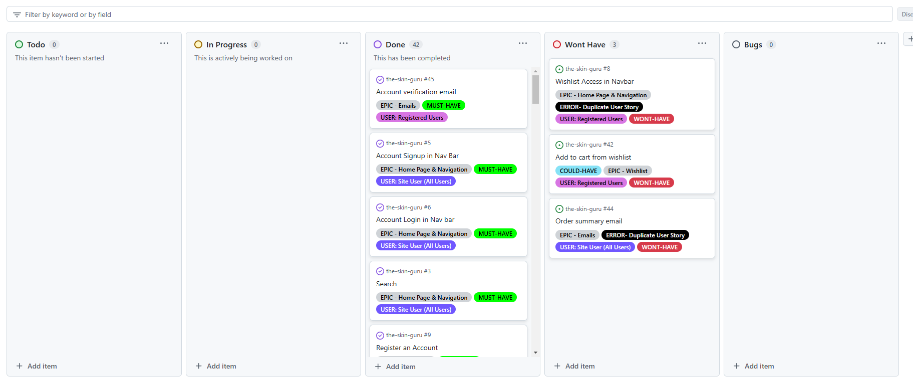

 

____

### UX

#### Strategy

* **User Engagement:** The website will prioritize a user-friendly interface with simple navigation and clear CTAs encouraging users to explore products, read blog posts, and make purchases. Features such as quick access to product descriptions, easy-to-use search functionality, and a streamlined checkout process will enhance user interaction and increase conversion rates.

* **Brand Positioning:** The Skin Guru will be positioned as a go-to destination for young skincare enthusiasts, emphasizing its commitment to education and quality products. The website will showcase a curated selection of skincare items, complemented by informative content, creating an emotional connection with the target audience.

#### Scope

* **User Types:** The site will cater to two primary user groups: unregistered users who can browse products, read blog posts, and make purchases, and registered users who can save their information, view order history, and access personalized features.

* **Core Features:** Key functionalities will include a comprehensive product catalog with detailed descriptions and pricing, an intuitive search and filter system, an informative blog section, a simple account registration process, and a secure checkout system for both guest and registered users.

#### Structure

* **Information Hierarchy:** The site's information architecture will prioritize essential content. The homepage will feature direct links to popular product categories, latest blog posts, and login/register options, ensuring users can easily find what they need. As well as a newsletter sign up form to encourage users to keep informed of new launched, discounts and promotions, as well as receiving monthly skin tips.

* **Content Strategy:** Engaging blog article content will be developed that highlights product benefits, ingredients, and usage tips. The blog will feature skincare advice, trends, and educational content, building trust and encouraging product exploration.

#### Skeleton

##### Wireframes
Wireframes have been created for key pages including:

Home

 
Homepage(featuring shop by skin type and latest blog posts)

| Mobile View | Desktop View |
| ---| ---|
| 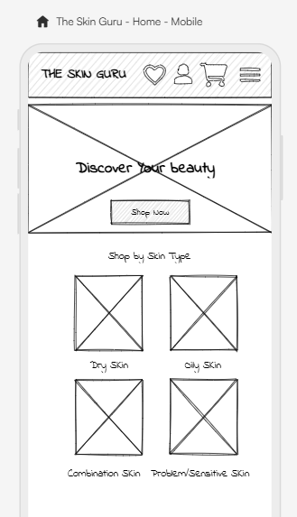  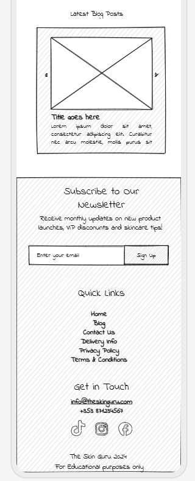 | 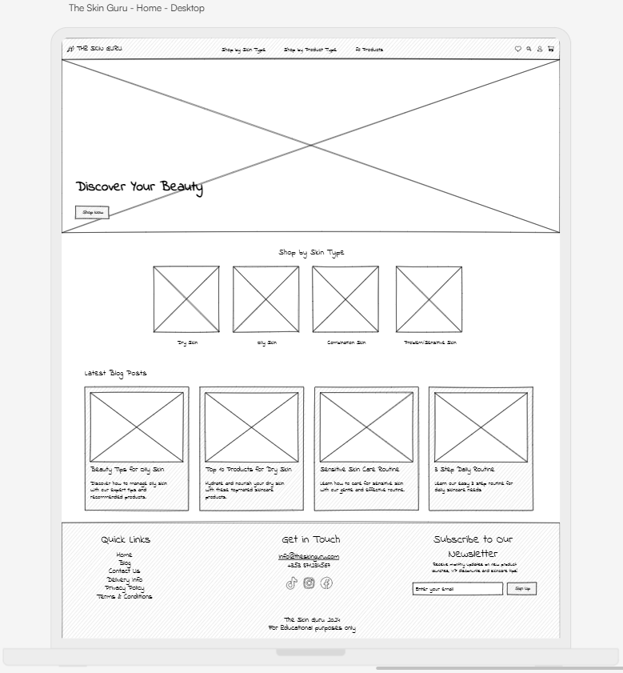 |

Product catalog

 
Product catalog (with filter and sort options)

| Mobile View | Desktop View |
| ---| ---|
| 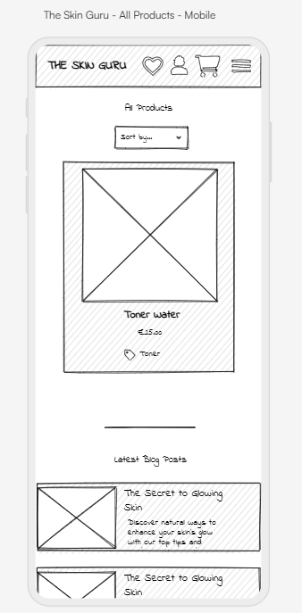 | 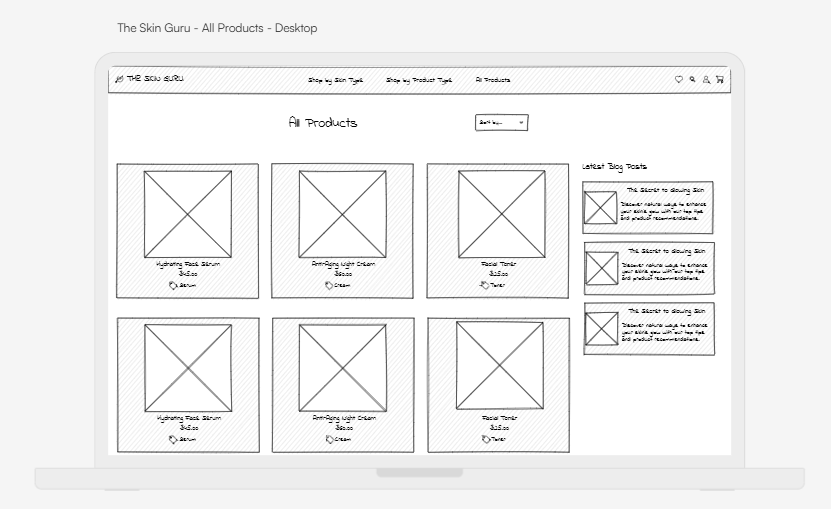 |

Product detail page

 
Product detail page(with comprehensive information and reviews)

| Mobile View | Desktop View |
| ---| ---|
| 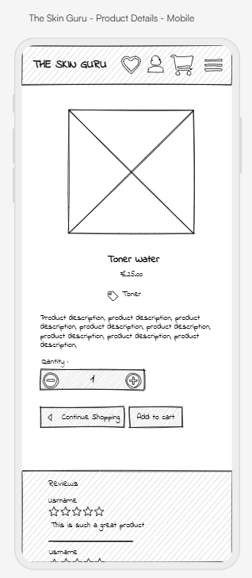 | 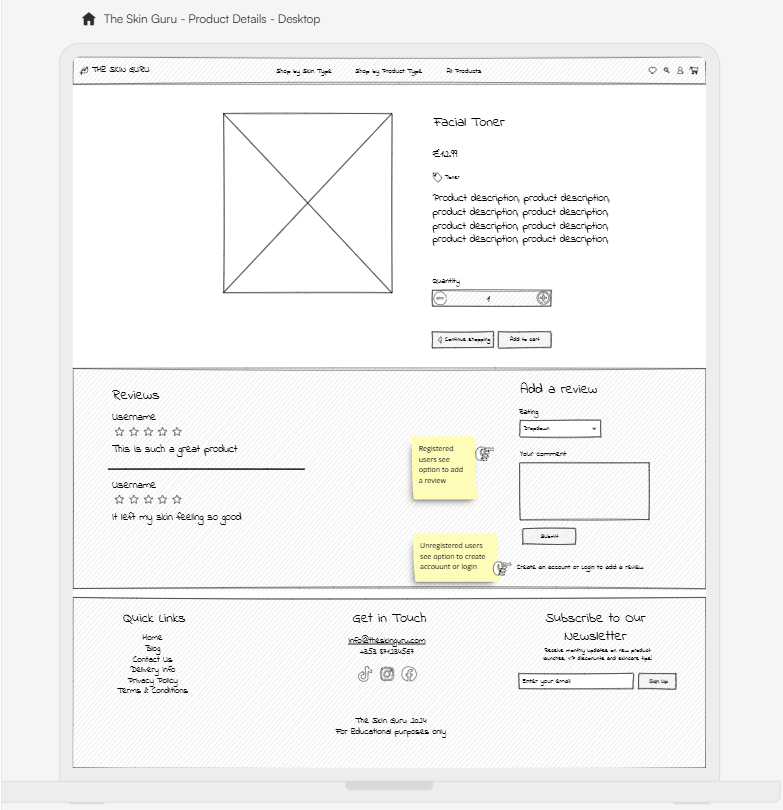 |

Blog

 
Blog (with categorized articles)

| Mobile View | Desktop View |
| ---| ---|
| 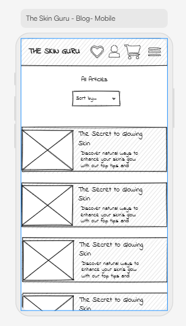 | 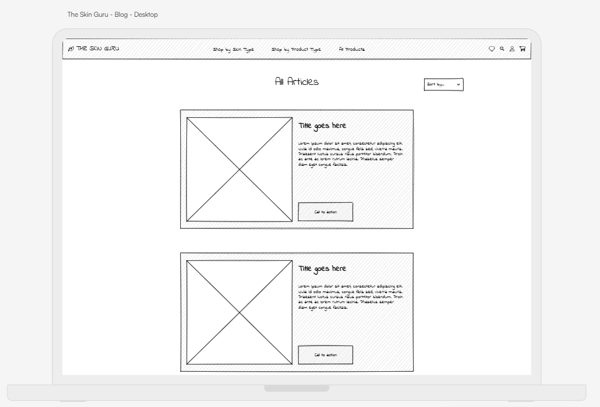 |

User account dashboard

 
User account dashboard (showing order history and saved details)

| Mobile View | Desktop View |
| ---| ---|
| 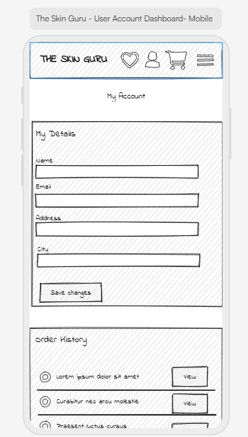 | 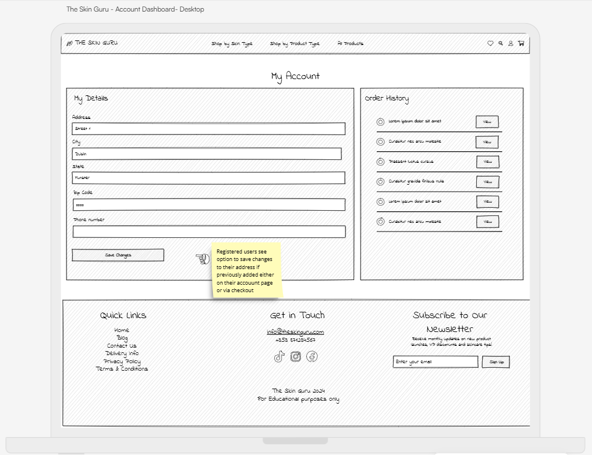 |

Checkout Page

 
Checkout Page (streamlined for both guest and registered users)

| Mobile View | Desktop View |
| ---| ---|
| 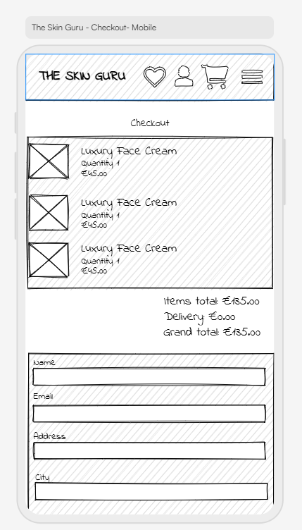 | 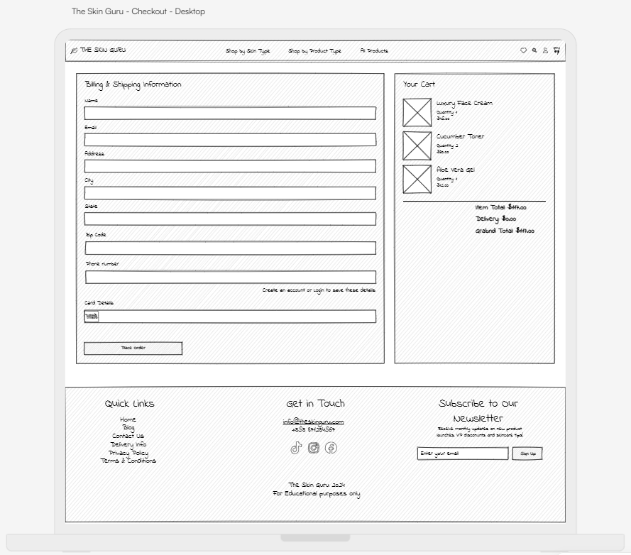 |

Mobile Menu

 

| Mobile View |  |
| ---| ---|
| 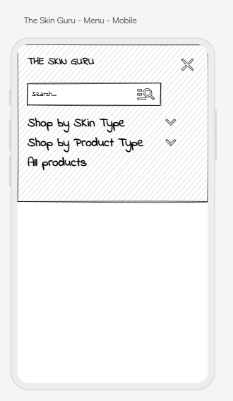 |  |

#### Surface

* **Visual Identity:** A fresh and vibrant color palette will be chosen to appeal to the young target audience. Typography will be selected for readability while reflecting a modern, trendy aesthetic that aligns with The Skin Guru's brand identity.

* **Responsive Design:** The website design will be fully responsive, ensuring optimal functionality across all devices - smartphones, tablets, and desktops. This is crucial for the target demographic who are likely to shop on mobile devices.

* **Accessibility Features:** Features like alt text for images, keyboard navigation options, and screen reader compatibility will be implemented to ensure inclusivity.

* **Feedback Mechanisms:** Visual feedback mechanisms in the form of confirmation messages for added products, successful purchases, and account actions will be implemented to enhance user experience and build trust.

 

____

### Design

#### Color Scheme
For The Skin Guru, the color palette was chosen to capture the essence of youthful energy and showcase brigh attractive colors:

* **Hot Pink** (#FFAEBC): Radiating vibrant energy, this bold shade embodies the spirited and confident nature of our young target audience.
* **Tiffany Blue** (#A0E7E5): A sophisticated yet playful hue that bridges elegance with youthful freshness. 
* **Mint** (#B4F8C8): A refreshing shade that evokes the clean, pure essence of skincare. It symbolizes the brand's focus on natural, gentle products that nurture young skin, creating a sense of calm and rejuvenation.
* **Soft Yellow** (#FBE7C6): Bringing warmth and optimism, this gentle tone represents the joy and positivity of effective skincare. It adds a cheerful, welcoming element that resonates with our young, enthusiastic audience.

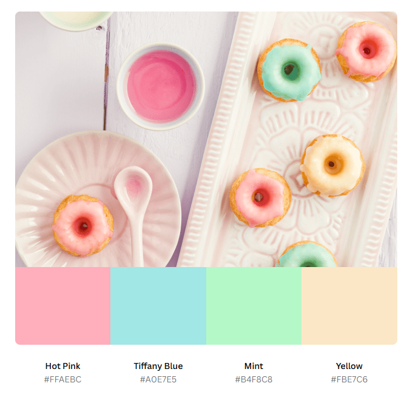 

 

#### Logo

I created my logo for The Skin Guru on [Logo.com](https://logo.com)

 

 

#### Typography

I chose the following typography for The Skin Guru on [Fontjoy.com](https://fontjoy.com/):
* **Chango** - as it’s a bold font to grab attention, but with a young and groovy vibe matching the font in my Logo.
* **Poppins** - for a modern vibe that keeps a clean aesthetic look to the site.

 

 

#### Imagery

All product images for this project were sourced from the brands own sites, along with their own product decriptions and details.
The article images were sourced from [Pexels.com](https://www.pexels.com/). The hero image and two own brand images were generated using AI image generator [DeepAI](https://deepai.org/machine-learning-model/text2img). The vector image for the featured shop by section of the home page was sourced from [Freepik.com](https://www.freepik.com/), and cropped to create the individual images for each skintype. Links and attributions are placed in the Credits section of this README.

 

____

### Database ERD

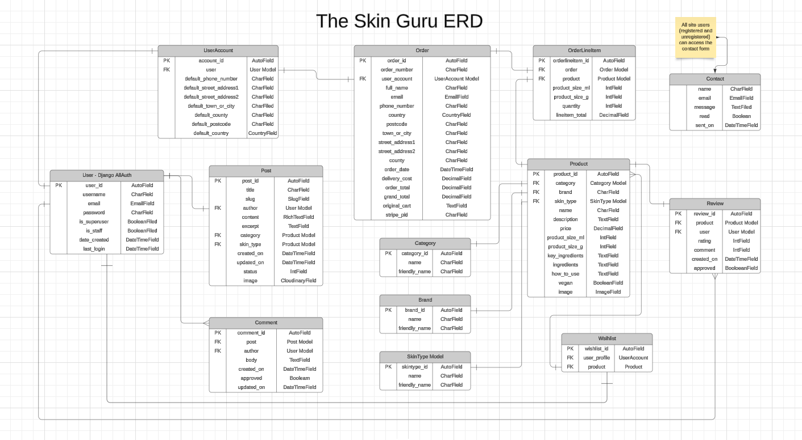 

 

____

### Project Features

#### Home Page

**Hero Section**

The Hero section contains a brand-neutral product image with the main CTA "Discover your Beauty - Shop Now" which takes users directly to the all products page.

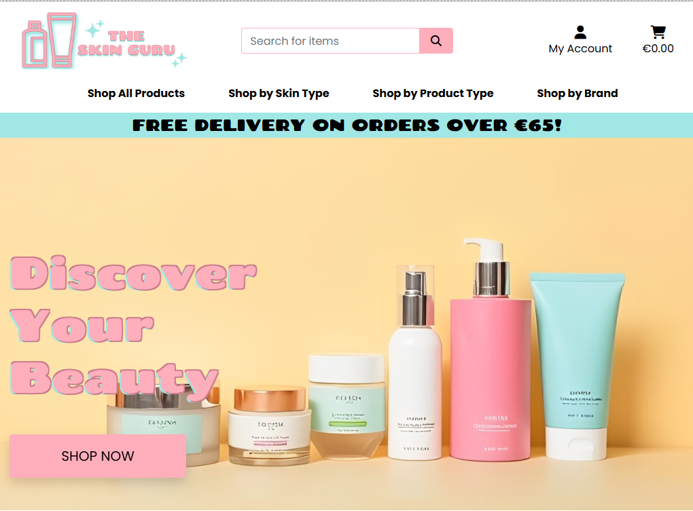

**Featured Shop By Section**

There is a featured shop by section to prompt users to discover products suited to their skin type.

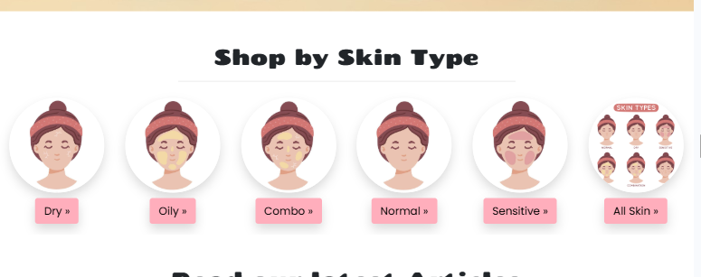

**Latest Articles Section**

The latest articles section features 4 of the latest articles, which will update each time admin adds a new article.

Although the primary focus for the layout of the entire site was mobile first, the articles and footr sections of home page have been designed to also suit extra large screen sizes.

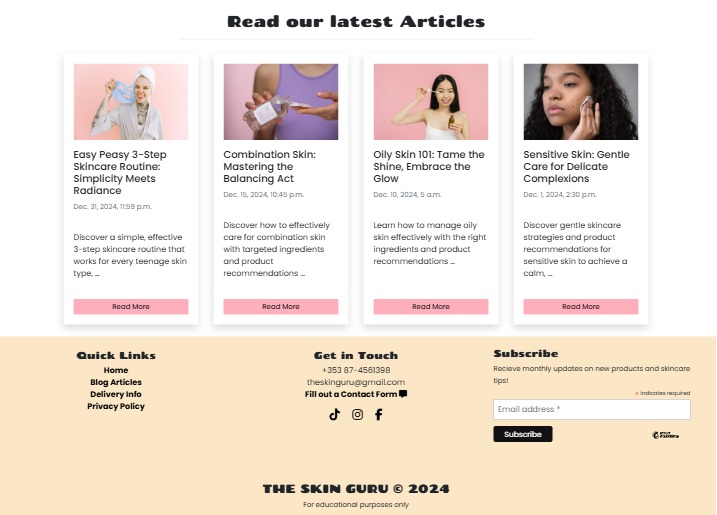

**Footer**

The footer features quick links, get in touch, and the newsletter sign up form.

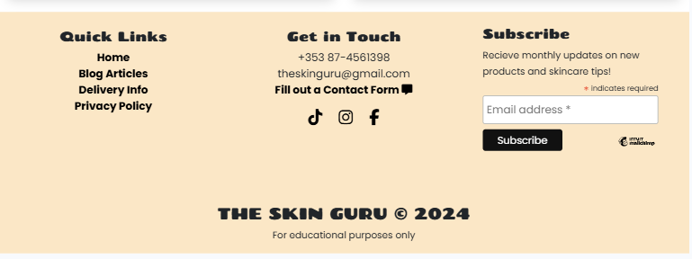

**Navbar**

The Navabr contains menu links for users to shop all products which links directly to the all products page, and dropdown options to shop by skin type, shop by product type and shop by brand. 

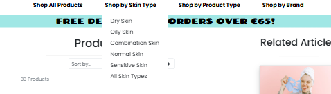

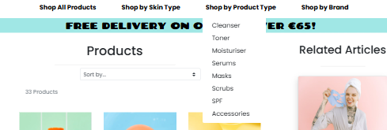 

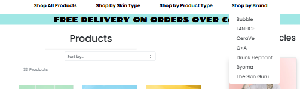 

The Navbar also contains the search box allowing users to search the site using their own search terms with both products names and descriptions being searchable. As well as My Accouunt dropdown and a Cart links.

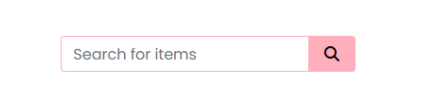 
 

 

#### All Products Page

The all products page showcases all the sites products, with the articles displayed on the right hand side (articles are displayed at the bottom on mobiles).

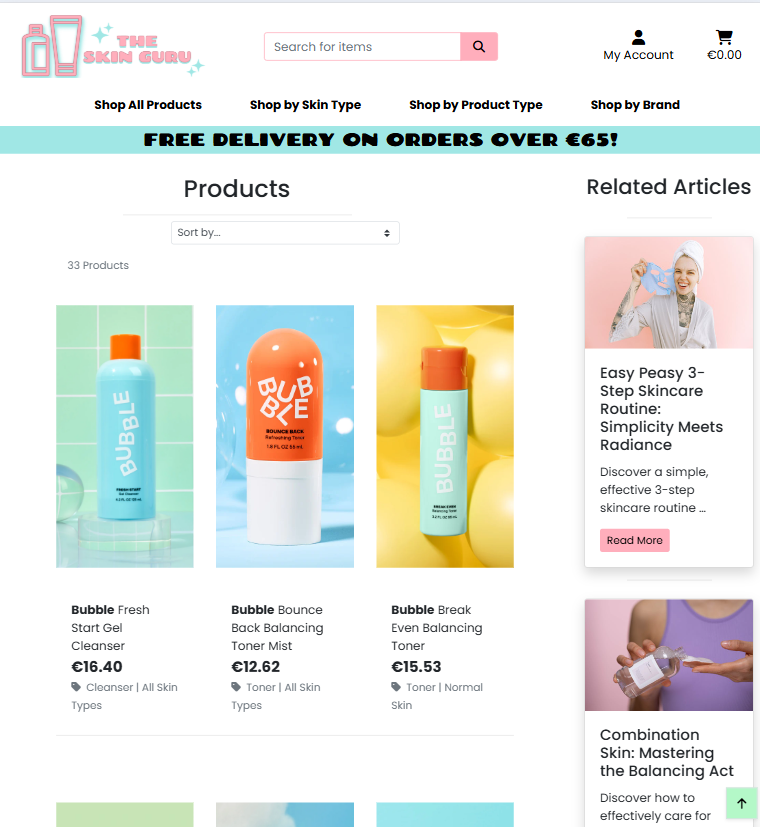

**Sort by dropdown**

Users can filter their own searches, or the products pages results by the sort by dropdown.

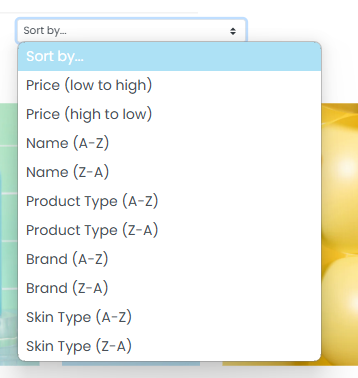

 

#### Product Details Page

Each product details page contains the product image and relevant details, as well and full decsription, key ingredients (incl all ingredient dropdown) and how to use sections.

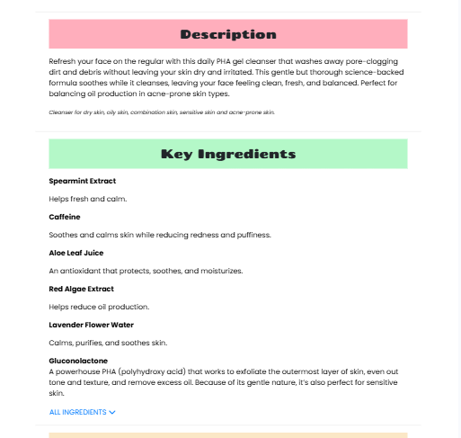

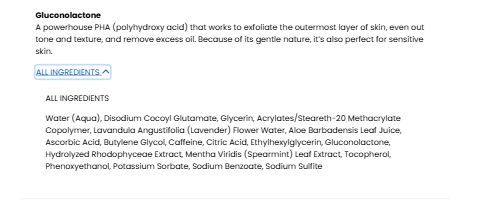

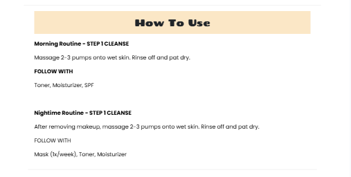

**Reviews Section**

Each product includes a product review section, which allows logged in users to leave a review of the product if they have purchased it (see Authenticated Users section further below)

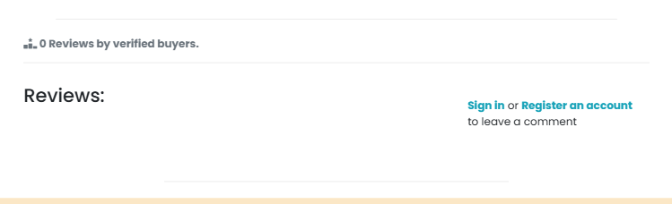

 

#### Articles

**All Article Page**

The articles page displays the articles to users, from most recent to oldest.

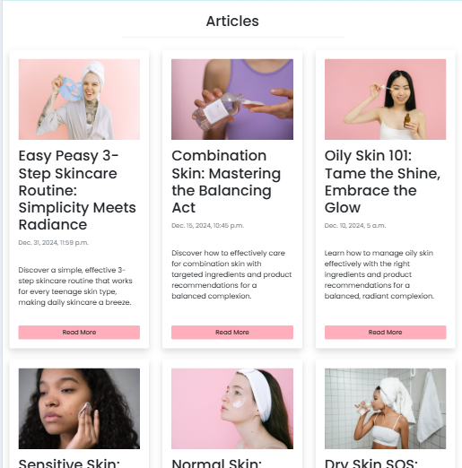

**Individual Article Page**

Each article details some product recomendations, skincare routines and links back to the product categories.

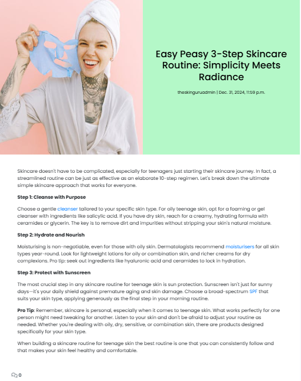

**Comments Section**

Each article includes a comments sections which allows logged in users to leave a comment (see Authenticated Users section further below).

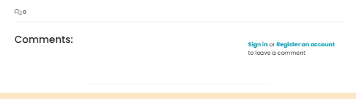

 

#### Cart & Checkout Pages

**Cart Page**

The cart page can be accessed at any point while browsing the site, and when nothing has been added yet users are brought back to the all products page with the keep shopping CTA.

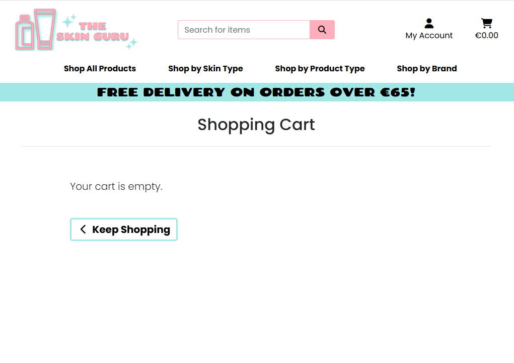

When users have a product in the cart, they are shown the product details, how many of that product is in their cart with the options to add more using the quantity input, and update or remove, as well as see the price for each item and a subtotal.

Below that, an order total, delivery cost and grand total.

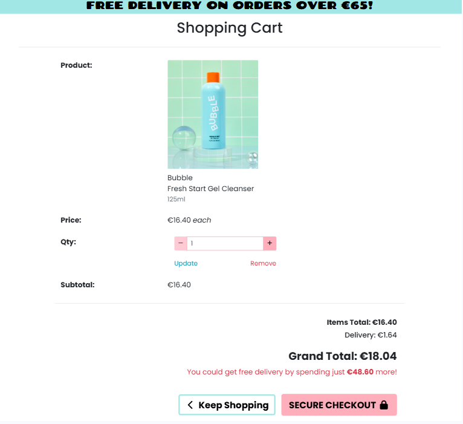

In the top right of the page, the Cart Icon now displays the cart total. This updates accordingly when items are added/removed and correspons to the cart and checkout pages..

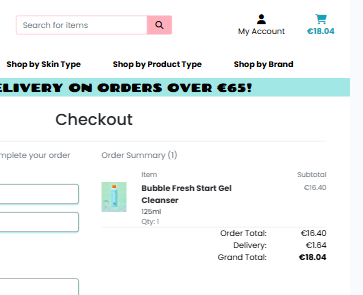

**Checkout Page**

After users navigate to the checkout page, they are shown a form to fill out as well as a summary of their order.
Users are prompted to sign in or create an account to save their details.

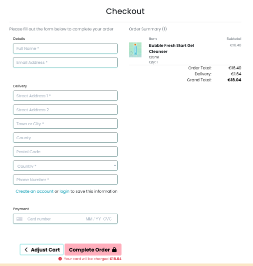

**Checkout Success Page**

After users have successfully made their order they are brought to the checkout success page which includes a success message at the top of the page and also details their order summary, and enncourages users to stay on the site with the Read our latest articles CTA.

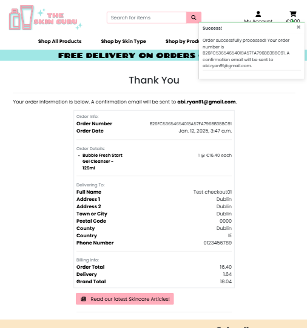

 

#### Contact Page

 

#### Account

**Sign In page**

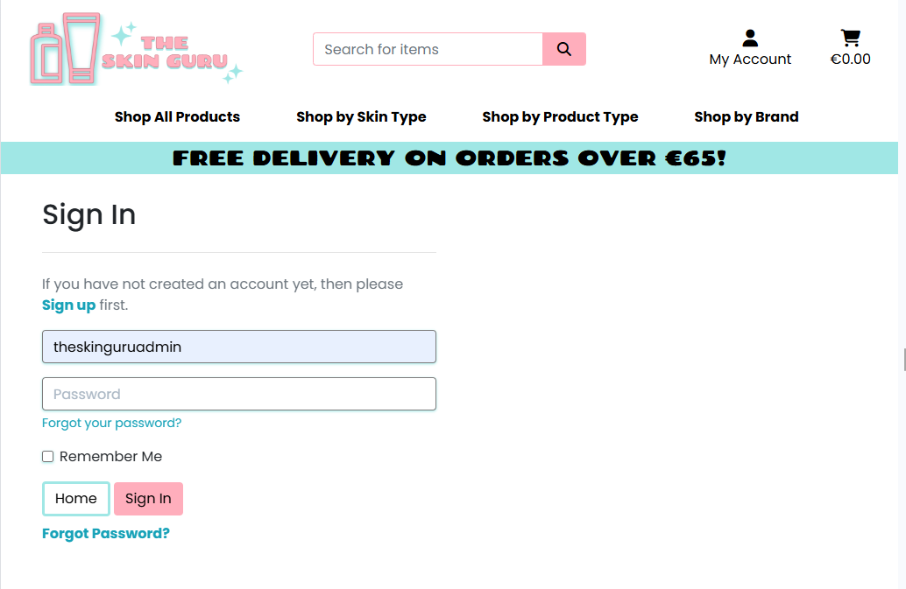

**Sign Up page**

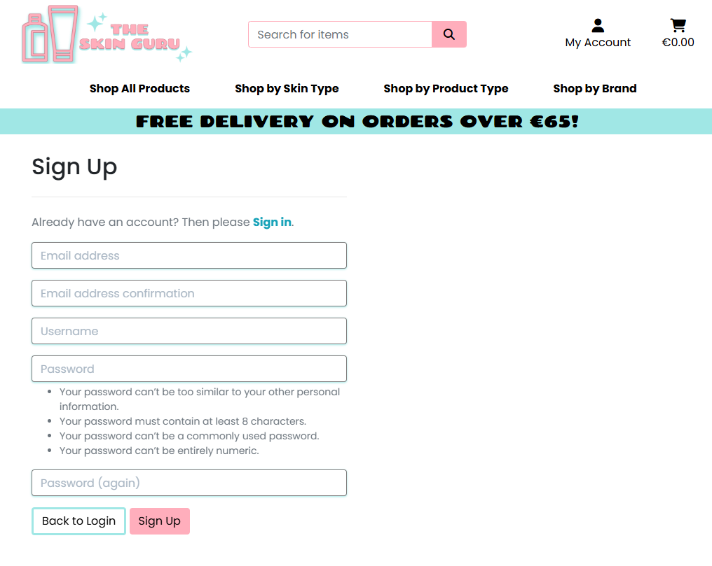

**Verify Account Page**

**Verify Account Email**

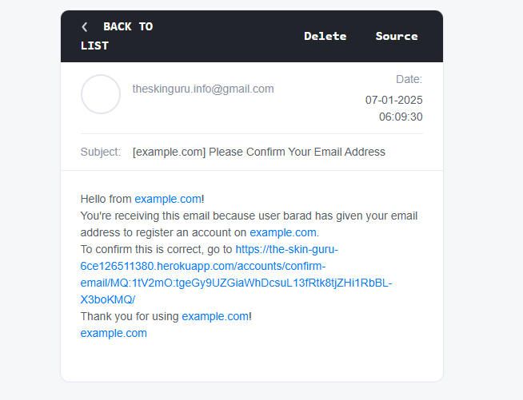

 

#### Authorised User Pages

**My Profile**

**My Wishlist**

**Prepopulated Checkout Form**

**Adding a commment**

**Editing a commment**

**Deleting a commment**

**Adding a review**

**Editing a review**

**Deleting a review**

 

#### Order Confirmation Emails

I used my own email address - theskinguru.info@gmail.com which was set up for this project, to test recieving order confirmation emails for both guest checkout and logged in user checkouts. I wanted to ensure order confirmations emails were sending to actual real email addresses as well as the account verification emails.

**Guest Checkout**

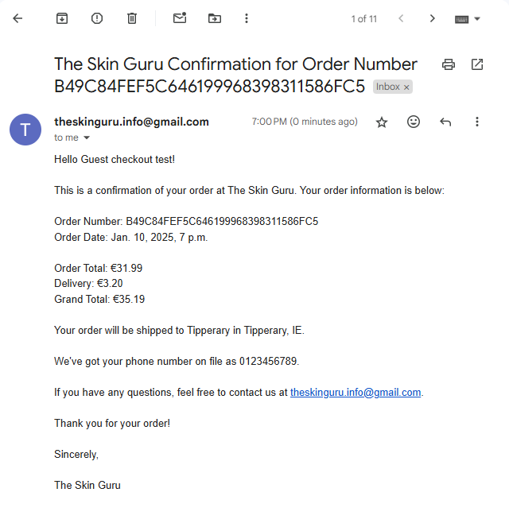

**Logged in User Checkout**

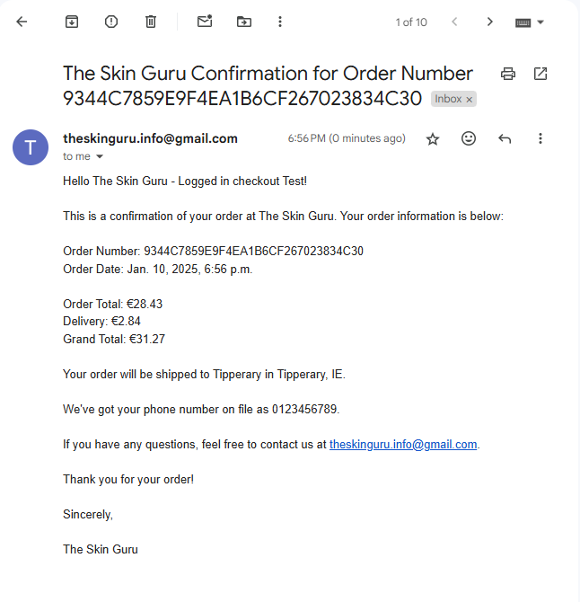

 

#### Feedback Messages

View all user feedback messages

 

**Log in/Log out**

**Add to cart success**

**Update cart success**

**Removed from cart success**

**Profile details updated success**

**Add to wishlist success**

**Removed from wishlist success**

**Contact form success**

**Comment submitted success**

**Comment updated success**

**Comment deleted success**

**Review submitted success**

**Review updated success**

**Review deleted success**

**Mailchimp Thank you message**

 

#### Custom Error Pages

**404 Error**

**500 Server Error**

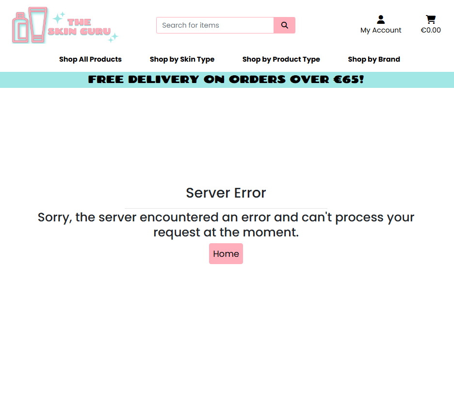

 

#### Admin Panel

**404 Error**

 

____

### Future Features

 

____

### Marketing

* **Business Model:**
The Skin Guru operates on a Business-to-Consumer (B2C) model, selling skincare products directly to individual customers.
* **Target Audience:**
Our customers are teens and young adults seeking their first skincare products or looking to expand their knowledge about products suitable for their skin type.
* **Online Platforms:**
Our target audience primarily engages on TikTok, Instagram & with less usage across Facebook.
* **User Needs and Content Strategy:**
We aim to provide skincare products specifically designed for young skin. To address the trend of young people using products meant for mature skin, we'll create easily digestible blog articles highlighting the benefits of The Skin Guru's products and educating users on proper skincare routines.
* **Sales and Promotions:**
We'll offer seasonal sales and discounts, communicating these offers through social media posts and our newsletter.
* **Marketing Budget and Approach:**
Initially, The Skin Guru will invest in paid content marketing on social media to build brand awareness. According to research carried out by [Skin Health Alliance](https://professionalbeauty.co.uk/gen-z-skincare-study-influencers-trends), 71% of Gen Z buy skincare based on influencer recommendations, and so Influencer marketing will be a key strategy to reach our young target audience. Simultaneously, we'll develop organic content to grow our social media following and build community engagement. As the brand expands, we'll incorporate user-generated content (UGC) into our social media and newsletter marketing efforts.

 

#### Content Marketing

The Blog feature of The Skin Guru project is used to create additional content aimed at customer engagement and retention. By publishing articles related to skincare and products available on the website, this feature encourages customers to return for informational purposes, potentially browsing products mentioned in the articles during their visit. These efforts help establish The Skin Guru as an expert in the skincare industry, building trust and credibility with the audience.

The blog includes a comment section for customer interaction and engagement, allows registered customers to submit their own skincare tips or routines, fostering community engagement and further solidifying The Skin Guru's position as a go-to resource for skincare knowledge.

Future expansions could include a skincare Q&A section or video tutorials demonstrating product usage. While these features require additional content creation from The Skin Guru team, they significantly contribute to customer education and brand loyalty, reinforcing the brand's expertise in the field

 

#### SEO

 

#### Social Media

According to research from [Pew Research Center](https://www.pewresearch.org/short-reads/2023/04/24/teens-and-social-media-key-findings-from-pew-research-center-surveys/) on Teens and Social Media usage, the most popular Social Media platforms are as follows:
* TikTok: About 67% of teens use TikTok, with a significant portion (16%) stating they use it almost constantly. It has rapidly gained popularity, especially among younger audiences.
* Instagram: Around 62% of teens use Instagram, with half of them visiting the platform at least once a day. It is particularly popular among teen girls.
* Facebook: Only 32% of teens report using Facebook, a significant drop from previous years, indicating a decline in its popularity among younger users.

Given the target audience's primary use of TikTok and Instagram, The Skin Guru's marketing strategy will prioritize video content on these platforms. While Facebook will serve as a valuable channel for paid advertising, the core marketing approach will focus on creating engaging, platform-specific video content.

The strategy involves:
* Developing short-form video content tailored to TikTok and Instagram
* Repurposing content across platforms with platform-specific adaptations
* Utilizing Facebook for targeted paid advertising campaigns
* Creating unique content strategies for each platform to maximize engagement

Below is a screenshot of a mockup of The Skin Guru’s Facebook page.

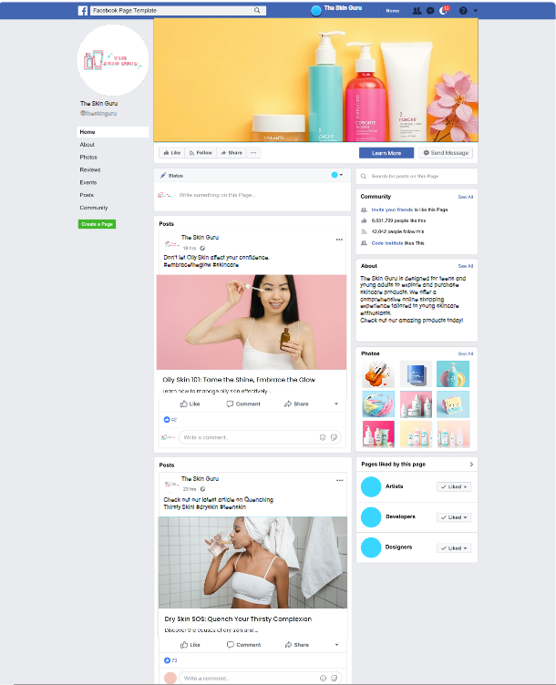 

 

#### Email

Through a subscription form in the footer, the website implements a newsletter sign up CTA using Mailchimp which collects users emails. 

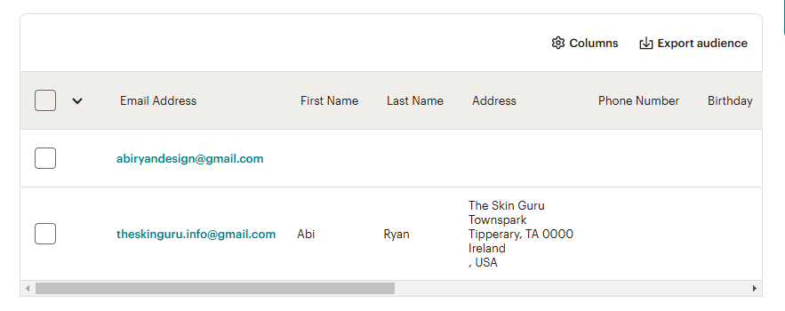 

The intention with the newsletter would be to update customers when new products are added to the site and new skincare articles are published, and also to send discount codes to newsletter subscribers.

I have not implemented a Thank You email to send once users sign up, howver I have created a template of the email that I would send if The Skin Guru was a real store.

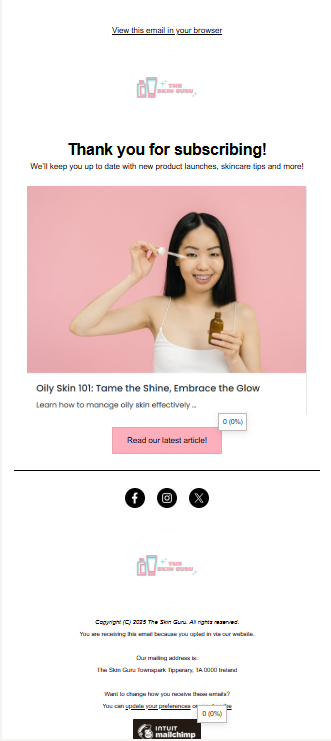 

 

____

### Technologies Used
#### Languages
#### Frameworks, Libraries, Technologies and Programs used

 

____

### Testing

 

____

### Deployment
#### Forking the GitHub Repository
#### Clone the GitHub Repository
#### Django Project Setup
#### Database Creation
#### Cloudinary
#### Deploying to Heroku

 

____

### Credits

Brand Links

 

* [Bubble](https://hellobubble.com/)
* [Laneige](https://www.laneige.com/int/en/index.html)
* [CeraVe](https://www.cerave.com/)
* [Q+A](https://www.qandaskin.com/)
* [Drunk Elephant](https://www.drunkelephant.com/)
* The Skin Guru product images were generated using [DeepAI](https://deepai.org/machine-learning-model/text2img)

Article Images

 

* [3 Step Routine](https://www.pexels.com/photo/happy-woman-removing-face-mask-after-taking-bath-3852159/) | Anna Shvets Mitkina
* [Sensitive Skin](https://www.pexels.com/photo/woman-removing-her-make-up-9253766/) | Ron Lach
* [Normal Skin](https://www.pexels.com/photo/calm-woman-with-face-cream-5069395/) | Anna Shvets
* [Combination Skin](https://www.pexels.com/photo/woman-holding-clear-bottle-of-facial-tonic-8131584/) | Ron Lach
* [Oily Skin](https://www.pexels.com/photo/woman-in-tank-top-applying-cosmetic-product-under-her-eye-9774839/) | SHVETS production
* [Dry Skin](https://www.pexels.com/photo/woman-in-white-spaghetti-strap-top-drinking-water-8142233/) | Ron Lach

Shop By Skin Type Images

 

* [Skin Type image](https://www.freepik.com/free-vector/hand-drawn-skin-types-illustration_12429021.htm#fromView=search&page=1&position=4&uuid=1ef7a355-e7af-49f1-9f6e-76ffa5fcd191) | Image by freepik 

 
____

#### Code References
#### Content and Media References

 

____

### Acknowledgements

 

____