# The Skin Guru
[View my live site here](https://the-skin-guru-6ce126511380.herokuapp.com/)

The Skin Guru is an e-commerce platform designed for teens and young adults to explore and purchase skincare products. The website offers a comprehensive online shopping experience tailored to young skincare enthusiasts. Unregistered users can browse the entire store catalog, explore a variety of skincare products, read informative blog posts about skincare tips and trends, and view detailed product information. The site provides full access to product descriptions, pricing, purchasing and general site content without requiring account creation. Registered users gain additional benefits by creating a personal account. 

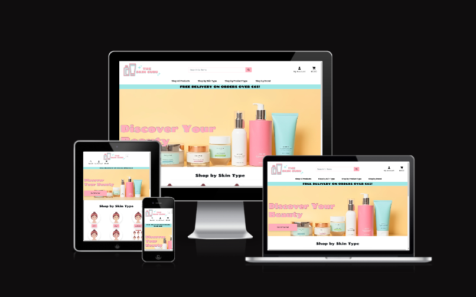

These users can:
* View and track their complete order history
* Save favorite products to a wishlist for future reference
* Write reviews under the products they have purchased
* Update their details from their personalised account dashboard.

The Skin Guru aims to be a user-friendly, educational, and accessible platform for young people looking to develop and maintain their skincare routines. By offering both guest browsing and enhanced registered user features, the site caters to different levels of user engagement and skincare knowledge.

____


## Contents
* [Project Goals](#project-goals)
* [User Stories](#user-stories)
* [Agile Development](#agile-development)
* [UX](#ux)
  * [Strategy](#strategy)
  *	[Scope](#scope)
  * [Structure](#structure)
  * [Skeleton](#skeleton)
    * [Wireframes](#wireframes)
  * [Surface](#surface)
* [Design](#design)
  * [Colour Scheme](#colour-scheme)
  * [Logo](#logo)
  * [Typography](#typography)
  * [Imagery](#imagery)
* [Database ERD](#database-erd)
* [Project Features](#project-features)
* [Security Features](#security-features)
* [Future Features](#future-features)
* [Marketing](#marketing)
	* [Content Marketing](#content-marketing)
  * [SEO](#seo)
  * [Social Media](#social-media)
  * [Email](#email)
* [Technologies Used](#technologies-used)
  * [Languages](#languages)
  * [Technologies and Programs used](#technologies-and-programs-used)
* [Testing](#testing)
* [Deployment](#deployment)
  * [Forking the GitHub Repository](#forking-the-github-repository)
  * [Clone the GitHub Repository](#clone-the-github-repository)
  * [Django Project Setup](#django-project-setup)
  * [Database Creation](#database-creation)
  * [Cloudinary](#cloudinary)
  * [Deploying to Heroku](#Deploying-to-heroku)
  * [Gmail](#gmail)
  * [Stripe](#stripe)
* [Credits](#credits)
  * [Code References](#code-references)
  * [Content and Media References](#content-and-media-references)
* [Acknowledgements](#acknowledgements)  


____

### Project Goals

The goal of The Skin Guru project is to establish a vibrant and user-friendly online platform where teens and young adults can easily explore a wide variety of skincare products. The site encourages visitors to engage with its content, including informative blog posts about skincare routines and tips, while also providing a seamless shopping experience. All users can browse the store, read insightful articles, and complete their purchases without needing to create an account. However, registered users enjoy additional features that enhance their shopping experience. The Skin Guru is dedicated to making skincare accessible and enjoyable for all, fostering a community of informed and empowered young consumers.

____

### User Stories

**Epic - Home Page and Navigation**

As a **Site User**(all users):

* I can **view the site's home page** so that I can **understand what the site is for.** - **MUST HAVE**
* I can **use the navigation menu** so that I can **easily make my way around the site.**	- **MUST HAVE**
* I can **use the search bar** so that I can **search for a specific item.** - **MUST HAVE**
* I can **shop products by “Skin Type” or “Product Type”** so that I can **view all available products in that category.** - **MUST HAVE**
* I can **create an account easily from the navbar** so that I can **log in to the site.** - **MUST HAVE**
* I can **log in to my account easily from the navbar** so that I can **manage my account.** - **MUST HAVE**
* I can **click the Cart button in the navbar** so that I can **view the products in my cart.** - **MUST HAVE**


As a **Registered User:**

* I can **access my Wishlist from the navbar** so that I can **view the products in my wishlist.** - **COULD HAVE**

<br>
<br>

**Epic - Registration**

As a **Site User** (all users):

* I can **register an account** so that I can **manage my order history, add products to my wishlist, save my personal details for faster checkout, leave a review on products I’ve purchased, add comments to blogs.** - **MUST HAVE**


As a **Registered User:**

* I can **edit my personal details on my account** so that I can **keep them up to date.** - **MUST HAVE**

<br>
<br>

**Epic - Products**

As a **Site User** (all users):

* I can **sort the products displayed on each product page** so that I can **filter the products to improve my search criteria.** - **MUST HAVE**
* I can **click an individual product** so that I can **view its details.** - **MUST HAVE**
* I can **click a -/+ button on a products details page** so that I can **manage the quantity of the product I want to add to the cart.** - **MUST HAVE**
* I can **click “Add to cart” button on a products details page** so that I can **add to the product to the cart to purchase.** - **MUST HAVE**


As a **Site Admin:**

* I can **add a product to my site** so that I can **increase the range of products available on the site.** - **MUST HAVE**
* I can **edit existing products** so that I can **change the products description, price or image etc.**	- **MUST HAVE**
* I can **delete a product from my site** so that I can **remove it from sale.** - **MUST HAVE**

<br>
<br>

**Epic - Cart**

As a **Site User** (all users):

* I can **adjust quantities of products in my cart** so that I can **change the quantity of the product that I wish to purchase.** - **MUST HAVE**
* I can **click "remove" on a product in my cart** so that I can **remove a product from my cart before checkout.** - **MUST HAVE**

<br>
<br>

**Epic - Checkout**

As a **Site User** (all users):

* I can **go to checkout** so that I can **complete my purchase.** - **MUST HAVE**
* I can **view my order before checkout** so that I can **confirm my items for purchase.** - **MUST HAVE**
* I can **enter/update my delivery details** so that I can **provide the correct delivery and contact information.** - **MUST HAVE**
* I can **view my order summary details** so that I can **review my order after it is placed.** - **MUST HAVE**
* I can **receive an email after purchase** so that I can **have confirmation and record of my purchase.** - **MUST HAVE**


As a **Registered User:**

* I can **see my previously saved details already populated at checkout** so that I can **complete my purchases faster.** - **MUST HAVE**

<br>
<br>

**Epic - Blog Articles**

As a **Site User** (all users):

* I can **read blog articles** so that I can **stay up to date with the latest skincare information.** - **SHOULD HAVE**
* I can **view comments on articles** so that I can **see the conversation around the articles subject.** - **SHOULD HAVE**


As a **Registered User:**

* I can **add comments to articles** so that I can **join in the conversation.** - **SHOULD HAVE**
* I can **edit/update/delete my comments** so that I can **manage my comments on blog articles.** - **SHOULD HAVE**


As a **Site Admin:**

* I can **create, read, update, delete Blog Articles** so that I can **manage my content.** - **SHOULD HAVE**
* I can **approve/decline comments** so that I can **manage the comments section.** - **SHOULD HAVE**

<br>
<br>

**Epic - Contact Form**

As a **Site User** (all users):

* I can **fill out a contact form** so that I can **contact the business with any queries I may have.** - **COULD HAVE**


As a **Site Admin:**

* I can **store contact form submissions** so that I can **review them.** - **COULD HAVE**
* I can **mark contact form submissions as read** so that I can see **how many I still need to process.** - **COULD HAVE**

<br>
<br>

**Epic - Product Reviews**

As a **Site User** (all users):

* I can **view reviews on a product** so that I can **see other users feedback.** - **SHOULD HAVE**


As a **Registered User:**

* I can **create a review on a product I have purchased** so that I can **give feedback to the site owners and other users.** - **SHOULD HAVE**
* I can **edit/update/delete my review** so that I can **manage my reviews.** - **SHOULD HAVE**


As a **Site Admin:**

* I can **approve/decline reviews** so that I can **filter out negative reviews.** - **SHOULD HAVE**

<br>
<br>

**Epic - Wishlist**

As a **Registered User:**

* I can **click the 'Add to Wishlist' button** so that I can **keep a record of my favourite items.** - **COULD HAVE**
* I can **click the 'Wishlist’ heart icon** so that I can **see all the products in my Wishlist.** - **COULD HAVE**
* I can **click the 'Remove' button** so that I can **remove a product from my Wishlist.** - **COULD HAVE**
* I can **click the 'Add to cart' button** so that I can **add the product to my cart from in my Wishlist.** - **COULD HAVE**

<br>
<br>

**Epic - Newsletter**

As a **Site User** (all users):

* I can **enter my email into the newsletter form** so that I can **receive marketing emails about new products, promotions and skincare tips.** - **MUST HAVE**

<br>
<br>

**Epic - Emails**

As a **Site User** (all users):

* I can **receive an email after purchase** so that I can **view my order summary.** - **MUST HAVE**


As a **Registered User:**

* I can **receive a confirmation email upon registering an account** so that I can **verify my account.** - **MUST HAVE**

<br>

____

### Agile Development

The Skin Guru was developed using an agile methology. I used Github Projects Board to manage the development of this project, which can be [found here.](https://github.com/users/abigail-ryan/projects/4)
I prioritised my features for this site using the MoSCoW Method, ensuring critical elements required for the MVP had the most focus by adding in MUST-HAVE, SHOULD-HAVE, COULD-HAVE and later adding WONT-HAVE labels, as well as adding Epic’s and User, Regitered User and Admin labels to categorise each user story correctly. This helped me complete each section of my site without losing track of or focus on the most critical requirements.

However, I did complete all could have and should have user stories and ensured my site had the functionality I intended it to have from the start.

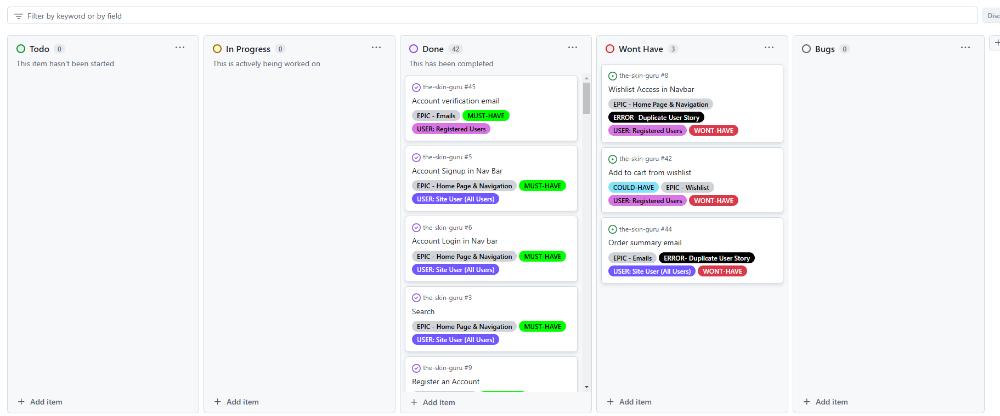


<br>

____

### UX

#### Strategy

* **User Engagement:** The website will prioritize a user-friendly interface with simple navigation and clear CTAs encouraging users to explore products, read blog posts, and make purchases. Features such as quick access to product descriptions, easy-to-use search functionality, and a streamlined checkout process will enhance user interaction and increase conversion rates.

* **Brand Positioning:** The Skin Guru will be positioned as a go-to destination for young skincare enthusiasts, emphasizing its commitment to education and quality products. The website will showcase a curated selection of skincare items, complemented by informative content, creating an emotional connection with the target audience.


#### Scope

* **User Types:** The site will cater to two primary user groups: unregistered users who can browse products, read blog posts, and make purchases, and registered users who can save their information, view order history, and access personalized features.

* **Core Features:** Key functionalities will include a comprehensive product catalog with detailed descriptions and pricing, an intuitive search and filter system, an informative blog section, a simple account registration process, and a secure checkout system for both guest and registered users.


#### Structure

* **Information Hierarchy:** The site's information architecture will prioritize essential content. The homepage will feature direct links to popular product categories, latest blog posts, and login/register options, ensuring users can easily find what they need. As well as a newsletter sign up form to encourage users to keep informed of new launched, discounts and promotions, as well as receiving monthly skin tips.

* **Content Strategy:** Engaging blog article content will be developed that highlights product benefits, ingredients, and usage tips. The blog will feature skincare advice, trends, and educational content, building trust and encouraging product exploration.


#### Skeleton

##### Wireframes
Wireframes have been created for key pages including:

<details>
<summary>Home</summary>
<br>
Homepage(featuring shop by skin type and latest blog posts)

| Mobile View | Desktop View |
| ---| ---|
| 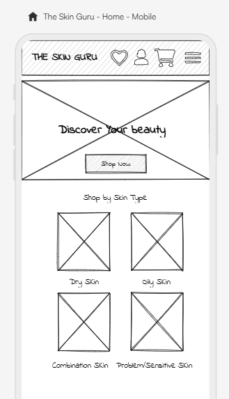  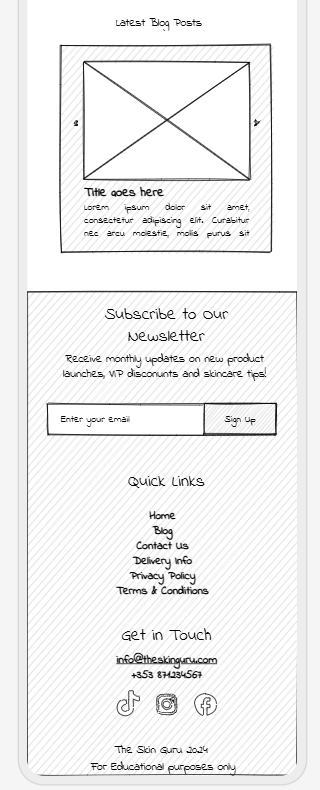 | 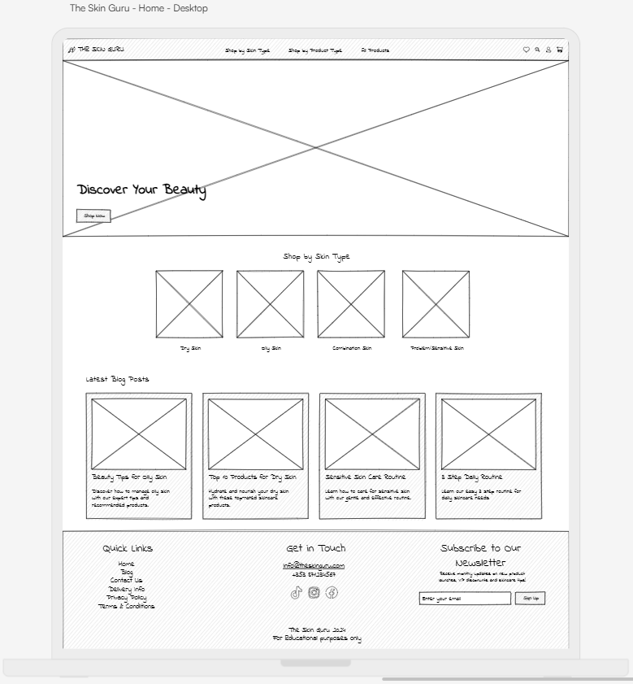 |
</details>


<details>
<summary>Product catalog</summary>
<br>
Product catalog (with filter and sort options)

| Mobile View | Desktop View |
| ---| ---|
| 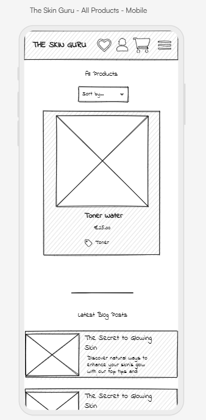 | 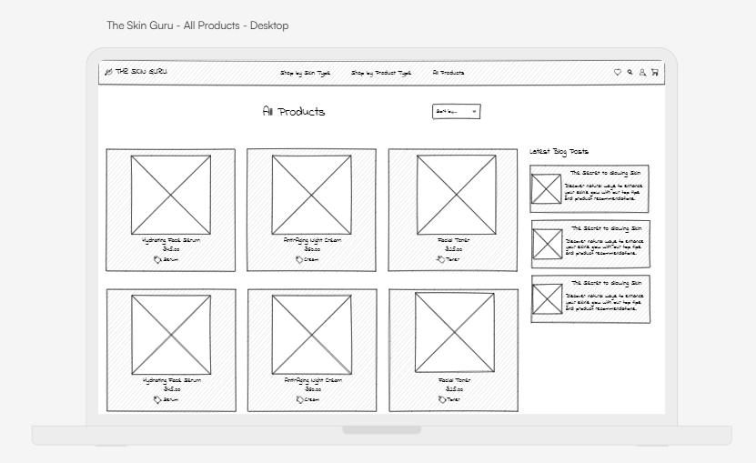 |
</details>


<details>
<summary>Product detail page</summary>
<br>
Product detail page(with comprehensive information and reviews)

| Mobile View | Desktop View |
| ---| ---|
| 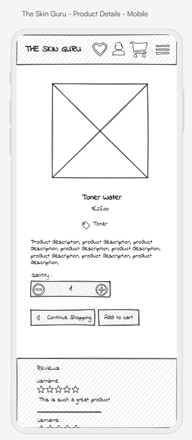 | 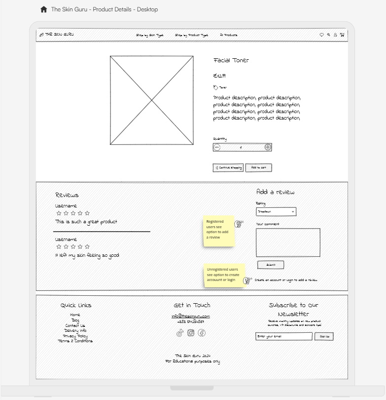 |
</details>


<details>
<summary>Blog</summary>
<br>
Blog (with categorized articles)

| Mobile View | Desktop View |
| ---| ---|
| 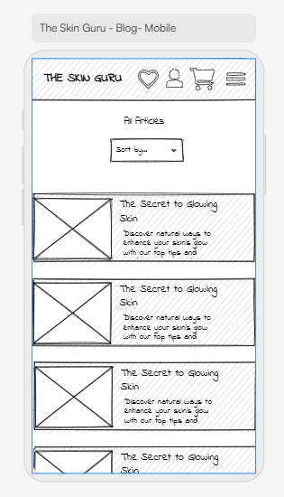 | 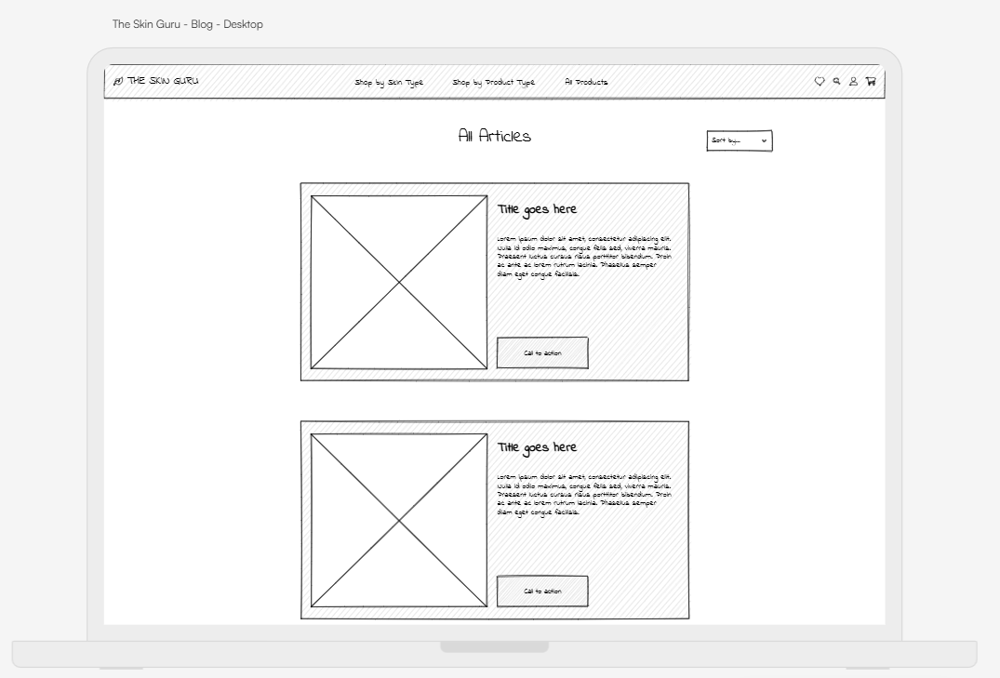 |
</details>


<details>
<summary>User account dashboard</summary>
<br>
User account dashboard (showing order history and saved details)

| Mobile View | Desktop View |
| ---| ---|
| 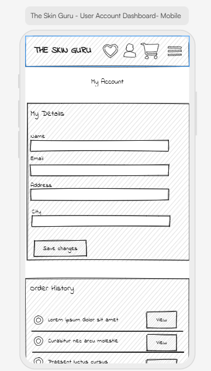 | 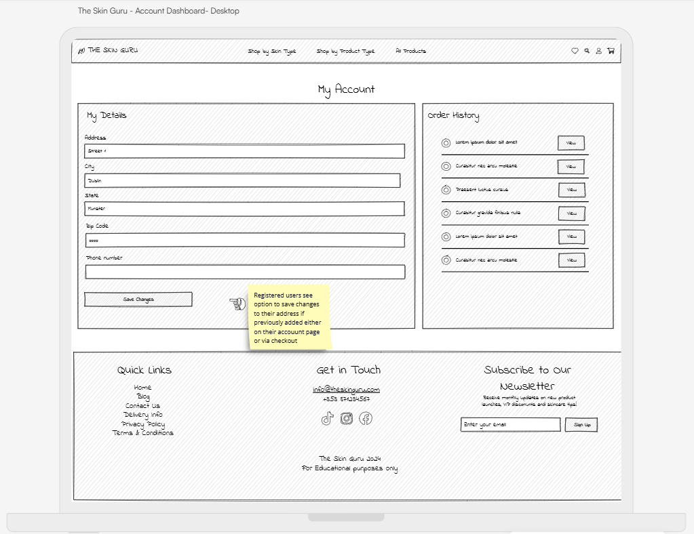 |
</details>


<details>
<summary>Checkout Page</summary>
<br>
Checkout Page (streamlined for both guest and registered users)

| Mobile View | Desktop View |
| ---| ---|
| 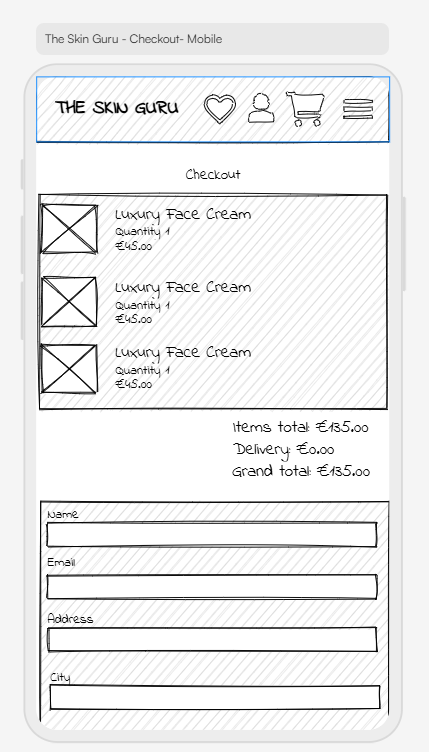 | 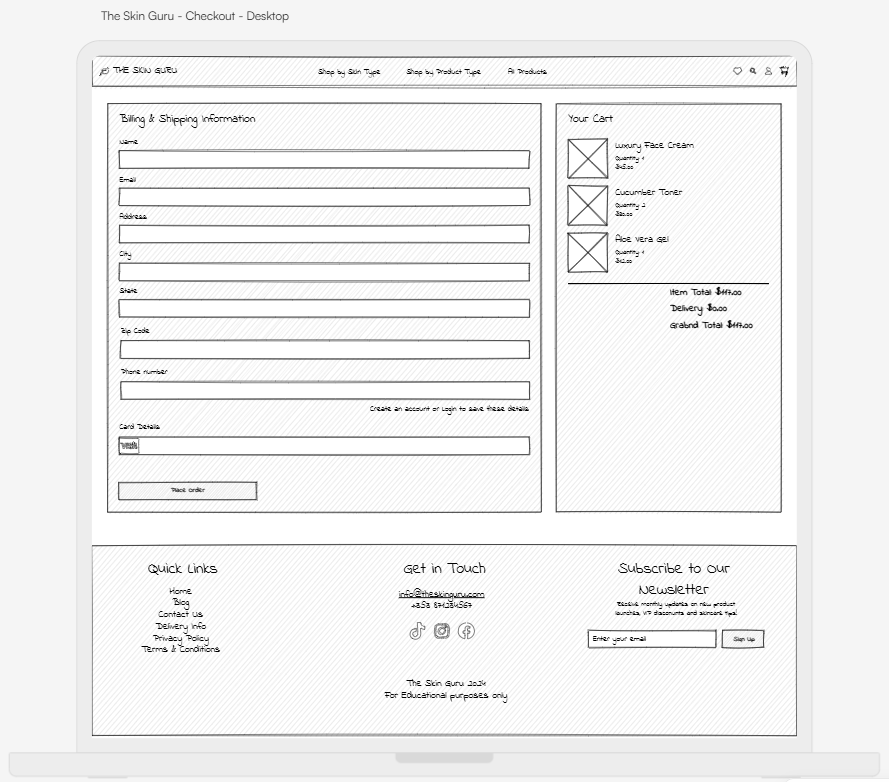 |
</details>


<details>
<summary>Mobile Menu</summary>
<br>

| Mobile View |  |
| ---| ---|
| 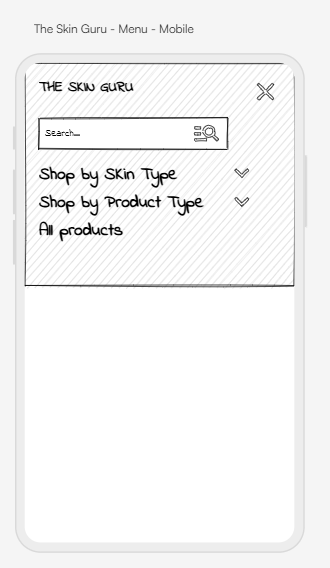 |  |
</details>


#### Surface

* **Visual Identity:** A fresh and vibrant color palette will be chosen to appeal to the young target audience. Typography will be selected for readability while reflecting a modern, trendy aesthetic that aligns with The Skin Guru's brand identity.

* **Responsive Design:** The website design will be fully responsive, ensuring optimal functionality across all devices - smartphones, tablets, and desktops. This is crucial for the target demographic who are likely to shop on mobile devices.

* **Accessibility Features:** Features like alt text for images, keyboard navigation options, and screen reader compatibility will be implemented to ensure inclusivity.

* **Feedback Mechanisms:** Visual feedback mechanisms in the form of confirmation messages for added products, successful purchases, and account actions will be implemented to enhance user experience and build trust.

<br>

____

### Design

#### Colour Scheme
For The Skin Guru, the color palette was chosen to capture the essence of youthful energy and showcase brigh attractive colors:

* **Hot Pink** (#FFAEBC): Radiating vibrant energy, this bold shade embodies the spirited and confident nature of our young target audience.
* **Tiffany Blue** (#A0E7E5): A sophisticated yet playful hue that bridges elegance with youthful freshness. 
* **Mint** (#B4F8C8): A refreshing shade that evokes the clean, pure essence of skincare. It symbolizes the brand's focus on natural, gentle products that nurture young skin, creating a sense of calm and rejuvenation.
* **Soft Yellow** (#FBE7C6): Bringing warmth and optimism, this gentle tone represents the joy and positivity of effective skincare. It adds a cheerful, welcoming element that resonates with our young, enthusiastic audience.

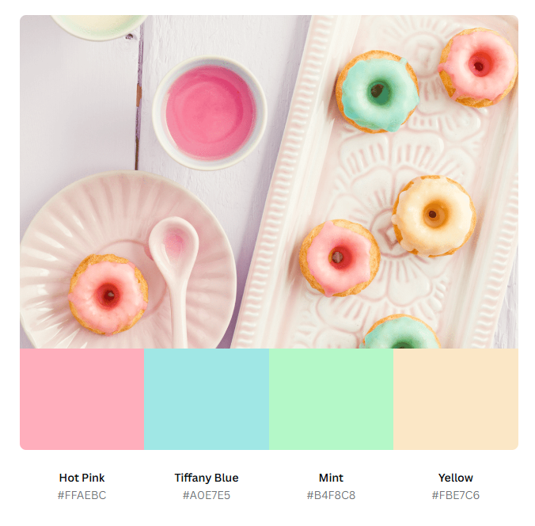 

<br>

#### Logo

I created my logo for The Skin Guru on [Logo.com](https://logo.com)

 

<br>

#### Typography

I chose the following typography for The Skin Guru on [Fontjoy.com](https://fontjoy.com/):
* **Chango** - as it’s a bold font to grab attention, but with a young and groovy vibe matching the font in my Logo.
* **Poppins** - for a modern vibe that keeps a clean aesthetic look to the site.

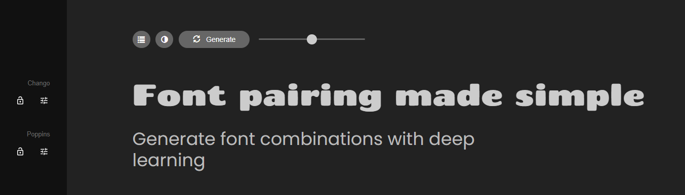 

<br>

#### Imagery

All product images for this project were sourced from the brands own sites, along with their own product decriptions and details.
The article images were sourced from [Pexels.com](https://www.pexels.com/). The hero image and two own brand images were generated using AI image generator [DeepAI](https://deepai.org/machine-learning-model/text2img). The vector image for the featured shop by section of the home page was sourced from [Freepik.com](https://www.freepik.com/), and cropped to create the individual images for each skintype. Links and attributions are placed in the Credits section of this README.

<br>

____

### Database ERD

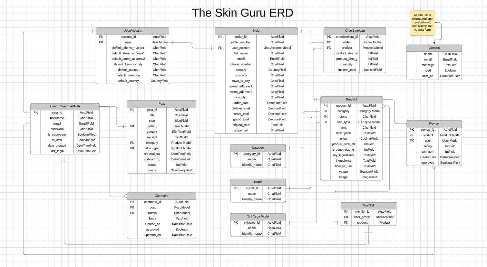 

<br>

____

### Project Features

#### Home Page

**Hero Section**

The Hero section contains a brand-neutral product image with the main CTA "Discover your Beauty - Shop Now" which takes users directly to the all products page.

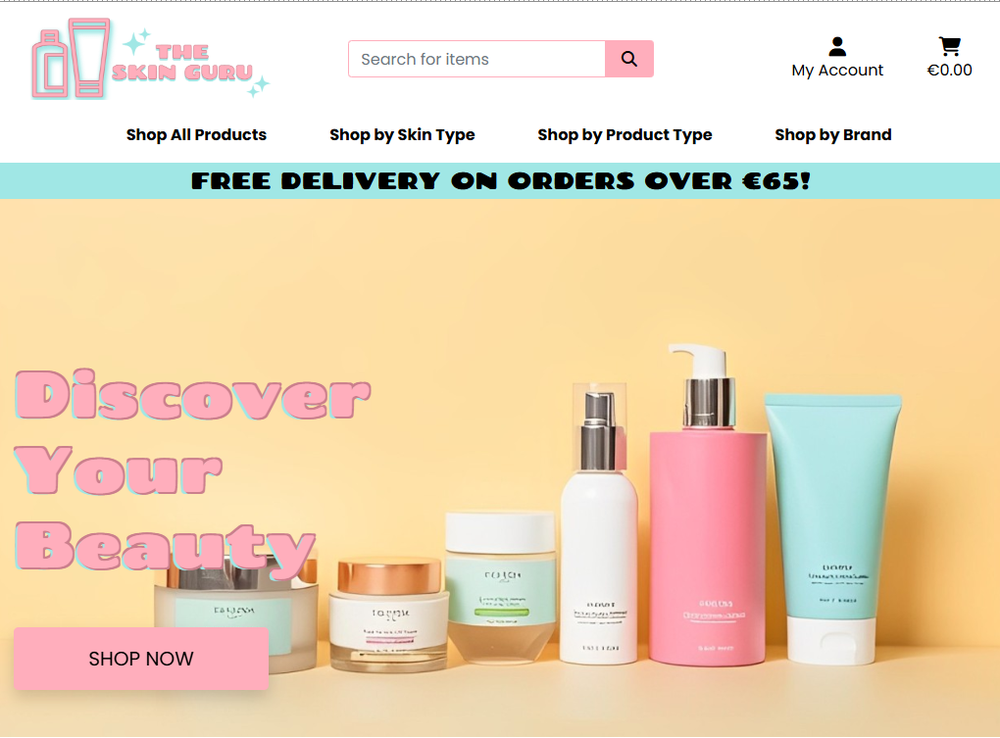

**Featured Shop By Section**

There is a featured shop by section to prompt users to discover products suited to their skin type.

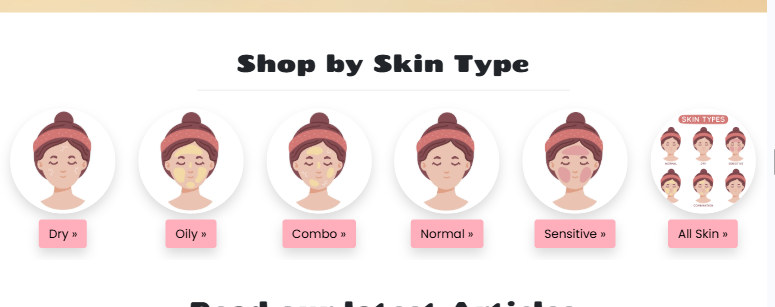

**Latest Articles Section**

The latest articles section features 4 of the latest articles, which will update each time admin adds a new article.

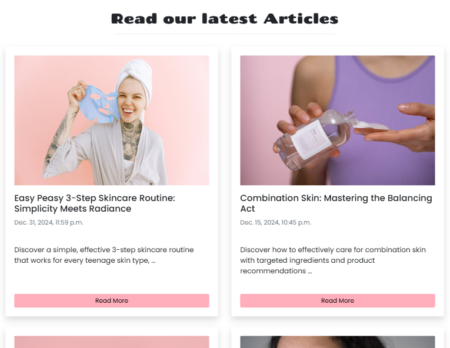

Although the primary focus for the layout of the entire site was mobile first, the articles and footr sections of home page have been designed to also suit extra large screen sizes.

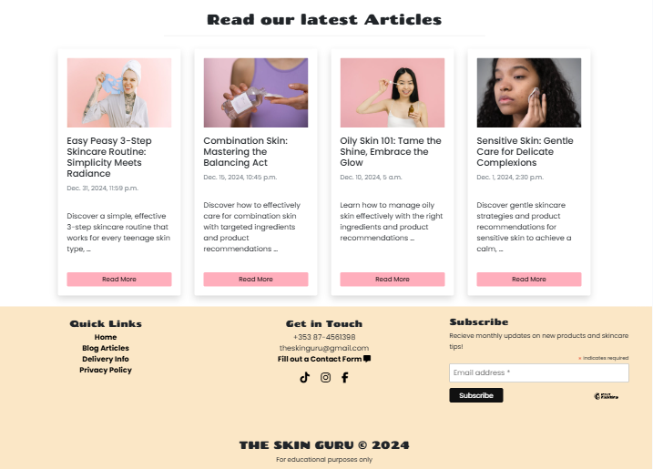

**Footer**

The footer features quick links, get in touch, and the newsletter sign up form.

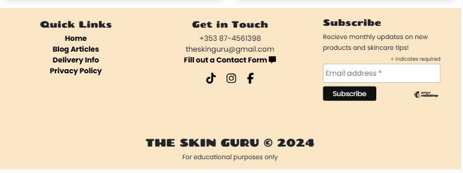

**Navbar**

The Navabr contains menu links for users to shop all products which links directly to the all products page, and dropdown options to shop by skin type, shop by product type and shop by brand. 

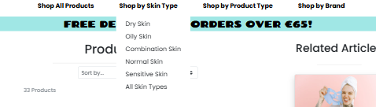

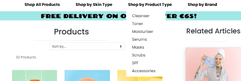 

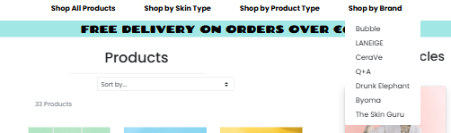 

The Navbar also contains the search box allowing users to search the site using their own search terms with both products names and descriptions being searchable. As well as My Accouunt dropdown and a Cart links.

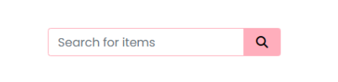 
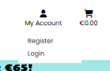 

<br>

#### All Products Page

The all products page showcases all the sites products, with the articles (all) displayed on the right hand side (articles are displayed at the bottom on mobiles).

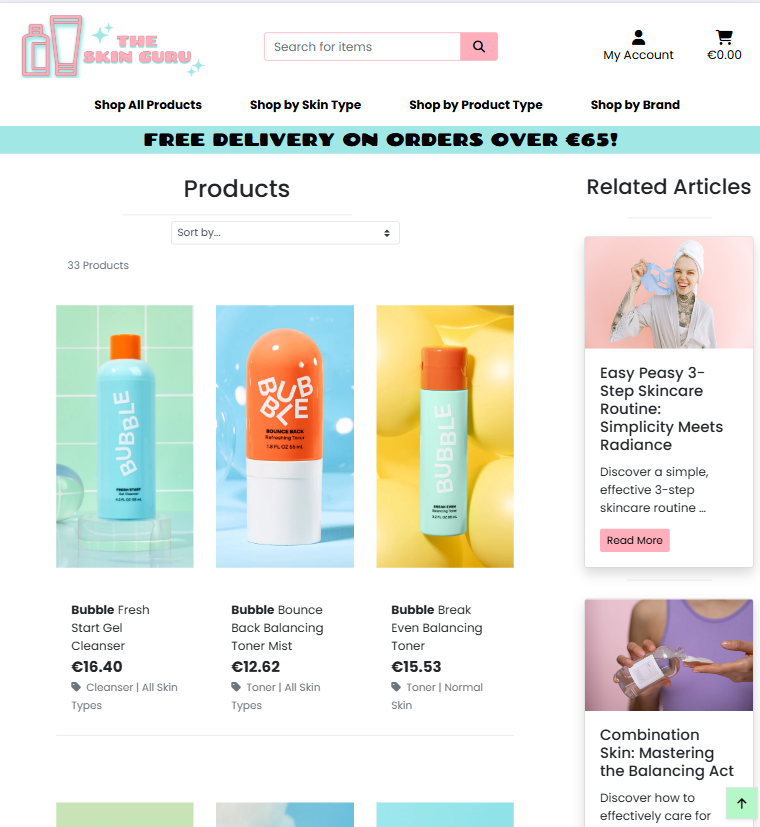

When a user clicks one of the Shop by Skin Type menu links, the relevant products and relevant article are displayed to the user.

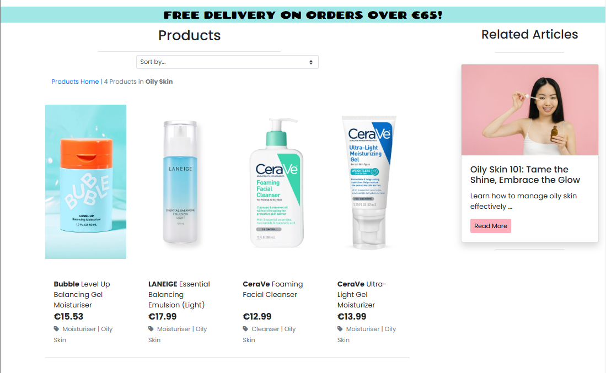

**Sort by dropdown**

Users can filter their own searches, or the products pages results by the sort by dropdown.

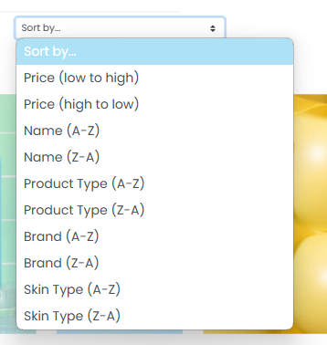

**Coming Soon Page**

I didn't add product to one brand and one category in order to show users that new products would be coming soon, encourageing return visits.

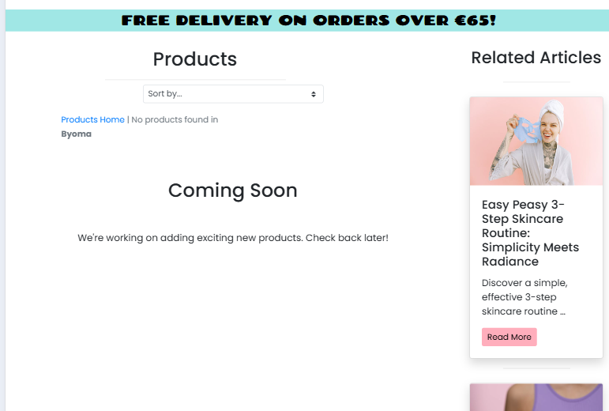

<br>

#### Product Details Page

Each product details page contains the product image and relevant details, as well and full decsription, key ingredients (incl all ingredient dropdown) and how to use sections.

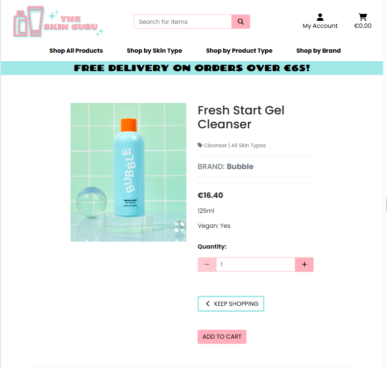

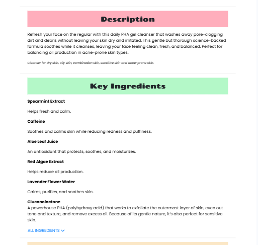

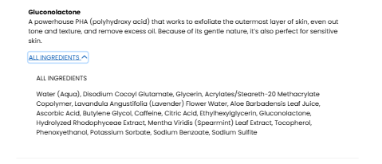

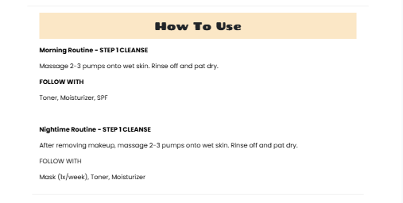

**Reviews Section**

Each product includes a product review section, which allows logged in users to leave a review of the product if they have purchased it (see Authenticated Users section further below)

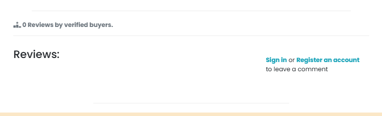

<br>

#### Articles

**All Article Page**

The articles page displays the articles to users, from most recent to oldest.

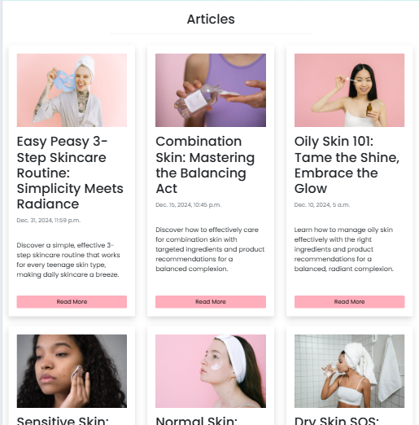

**Individual Article Page**

Each article details some product recomendations, skincare routines and links back to the product categories. The articles contents were written with the help of AI and edited by me to suit the style and tone of The Skin Guru's messaging. All article content is purely for demonstartive purposes only.

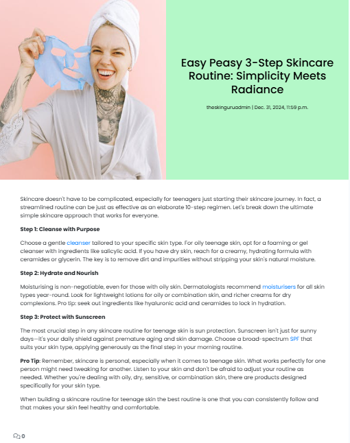

**Comments Section**

Each article includes a comments sections which allows logged in users to leave a comment (see Authenticated Users section further below).

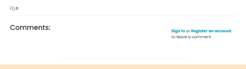

<br>

#### Cart & Checkout Pages

**Cart Page**

The cart page can be accessed at any point while browsing the site, and when nothing has been added yet users are brought back to the all products page with the keep shopping CTA.

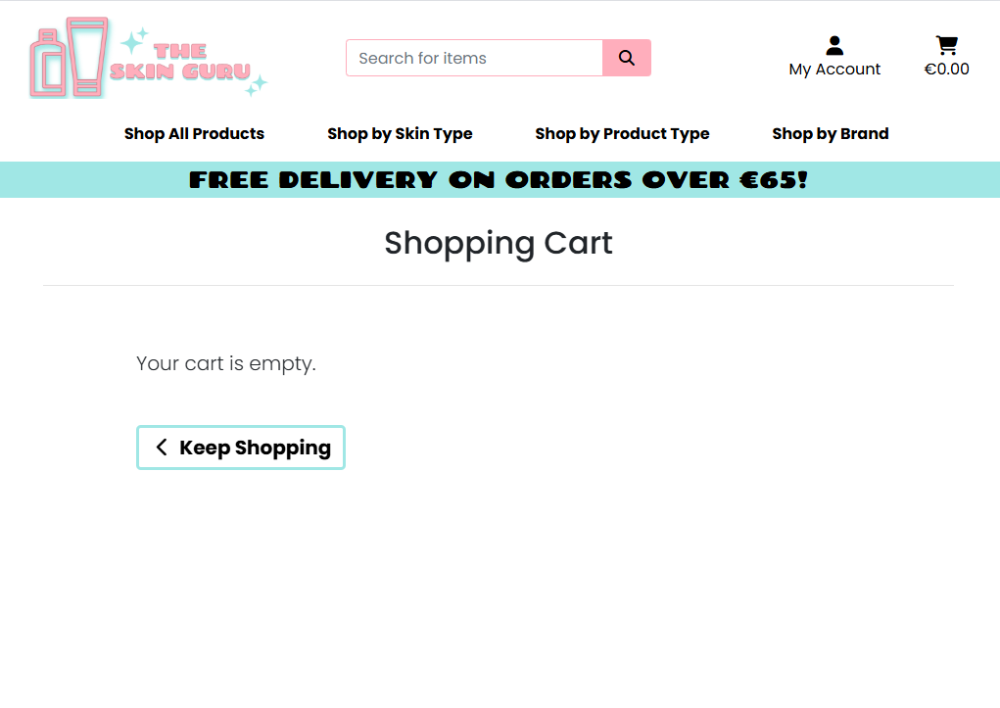

When users have a product in the cart, they are shown the product details, how many of that product is in their cart with the options to add more using the quantity input, and update or remove, as well as see the price for each item and a subtotal.

Below that, an order total, delivery cost and grand total.

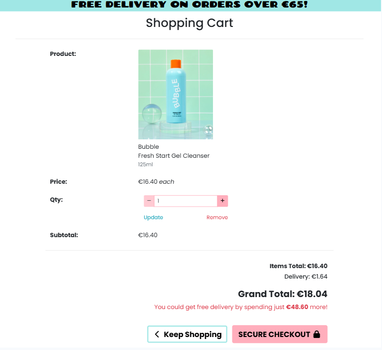

In the top right of the page, the Cart Icon now displays the cart total. This updates accordingly when items are added/removed and correspons to the cart and checkout pages..

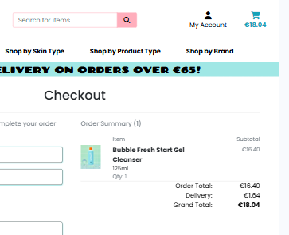

**Checkout Page**

After users navigate to the checkout page, they are shown a form to fill out as well as a summary of their order.
Users are prompted to sign in or create an account to save their details.

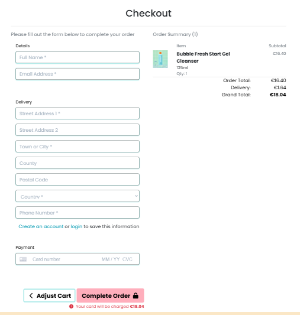

Within the checkout form there is phone number validation which requires users to input only digits, and a phone number with a minimum of 10 and max of 15 digits. Below shows the inline error message shown if a user tries to input text, or less/more digits than allowed. The user is notified of the error before clicking through to complete their order.


**Checkout Success Page**

After users have successfully made their order they are brought to the checkout success page which includes a success message at the top of the page and also details their order summary, and enncourages users to stay on the site with the Read our latest articles CTA.

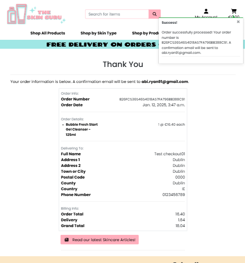

<br>

#### Contact Page

All site users can flll out a contact form accessible in the footer, to get in touch directly with the business.

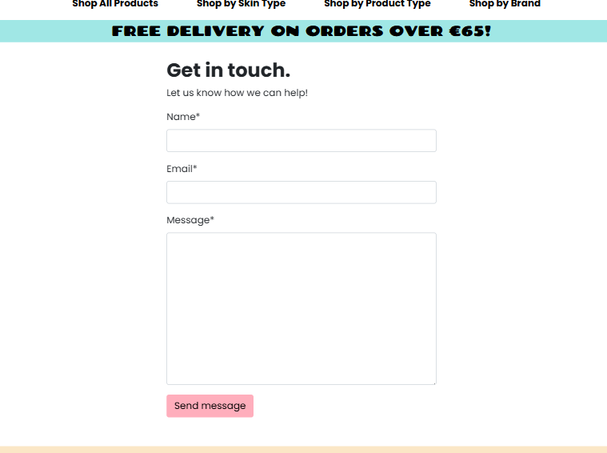

<br>

#### Delivery Info Page

All site users can visit the delivery informatioon page from the footer to see expected delivery times.

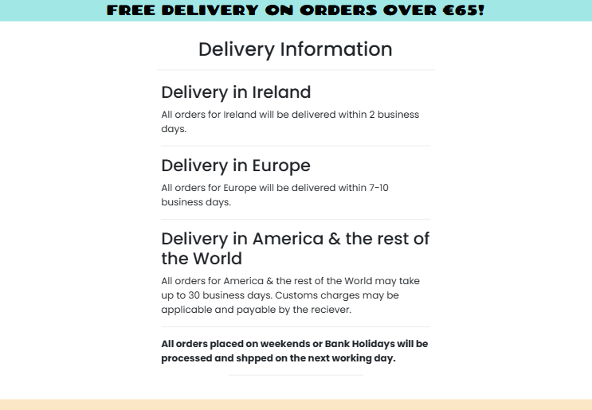

<br>

#### Account

**Sign In page**

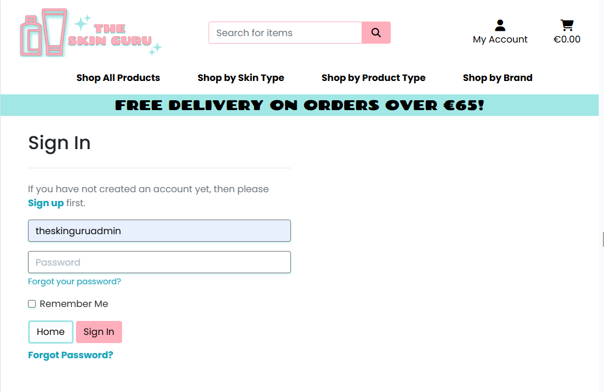

**Sign Up page**


**Sign Out page**

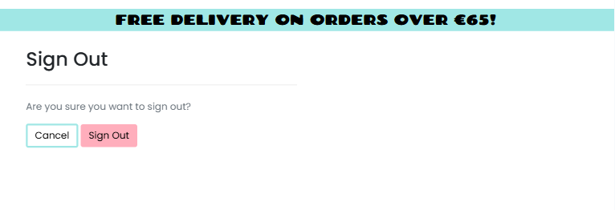

**Verify Account Page**

When users register an account, they must first verify their email adddress.


The user must follow the link in the email which brings them to the confirmation page.


<br>

#### Authorised User Pages

**Products**

The product now shows the user the option to add to their wishlist, which is automatically created when a product is added. 


**My Profile**

Profiles are automatically created for each user upon successful registration. When a user updates their information here, it will be prepopulated in the checkout page when they go to make a purchase. Alternatively, if users visit checkout first, they can save their details to their profile, which will then show up here on the profile page.


Within the profile form there is phone number validation which requires users to input only digits, and a phone number with a minimum of 10 and max of 15 digits. Below shows the error message shown as well as a notification in the top right corner alerting the user there is an error in the form if they have tried to save their phone number field with text, or less/more digits than allowed.


When users have made orders they can access them in the Profile dashboard and are shows the checkout success page, with an alert lettinng them know this is a past order.


**My Wishlist**


**Prepopulated Checkout Form**


**Adding a commment**

Registered account users can add comments to the blog articles.


**Editing a commment**

Users can edit their comments.


**Deleting a commment**

Users can delete their comments, and are presented with a confirmation pop up to confirm the action.


**Adding a review**

Registerd Users who have purchased a product can leave a review, but only if they have purchased that specific product. This ensures only genuine and verified reviews can be left under products on the site.


**Editing a review**

Users can edit their reviews.


**Deleting a review**

Uses can delete their reviews, and are presented with a confirmation pop up to confirm the action.


<br>

#### Order Confirmation Emails

I used my own email address - theskinguru.info@gmail.com which was set up for this project, to test recieving order confirmation emails for both guest checkout and logged in user checkouts. I wanted to ensure order confirmations emails were sending to actual real email addresses as well as the account verification emails, rather than just testing on tempmail addresses.

**Guest Checkout**


**Logged in User Checkout**


<br>

#### Feedback Messages

<details>
<summary>View all user feedback messages</summary>
<br>

**Log in/Log out**


**Accouunt Confirmation**


**Add to cart success**


**Update cart success**


**Removed from cart success**


**Order Confirmation Success**


**Profile details updated success**


**Order History Alert**


**Add to wishlist success**


**Removed from wishlist success**


**Contact form success**


**Comment submitted success**


**Comment updated success**


**Comment deleted success**


**Review submitted success**


**Review updated success**


**Review deleted success**


**Mailchimp Thank you message**


</details>

<br>

#### Custom Error Pages

**404 Error**


**500 Server Error**


<br>

#### Admin Panel

**Admin**

In the adminn panel, admin have access to all the orders, contact forms, comments and reviews from users, and have full CRUD functionlity for all features of the site. All comments and reviews submitted by registered users must be approved by admin.


<br>

#### Stripe Webhooks

Throughout development I was having issues with guest checkouts not receiving order confirmation emails and payment_intent_success failuers in my stripe dashboard.
The issue was fixed and now both guest checkouts and logged in user checkouts are all successfull. See reference to this in TESTING.md file.

**Guest Checkout**


**Logged in User Checkout**


<br>


____

### Security Features

#### User Authentication

* Django Allauth was installed to provided a secure set of features for managing user authentication, registration, and account management.

#### Login Security

* @login_required decorator was added to views that are for account holders only to ensure that a user must be logged in to access certain views. 
* If a user who is not authenticated tries to access a view that uses this decorator, they will be redirected to the login page.

#### CSRF Protection

* Django provides built-in protection against Cross-Site Request Forgery (CSRF) attacks. CSRF tokens are generated for each user session, and they are required to submit forms or perform state-changing actions. When a user logs out, the session and associated CSRF token are invalidated, making it difficult for an attacker to forge a valid request using a copied URL.

<br>

____

### Future Features

For Future development of this porject I would like to add the following:
* Add a Skin Type Quiz, where users who are unnsure of their skin type can answer a series of questions and receive personalised product recommendations.
* Add a disappearing pop up that shows current users on the site that “Someone just purchased X product…shop now” encouraging more conversions.
* Add allowing users to upload images with their reviews.
* Add a loyalty/rewards program where registered users receive points for every purchase that can be redeemed in coupons next time they shop.
* Add a discount coupon feature to the site enabling the newsletters recipients to avail of special discounts.

<br>

____

### Marketing


* **Business Model:**
The Skin Guru operates on a Business-to-Consumer (B2C) model, selling skincare products directly to individual customers.
* **Target Audience:**
Our customers are teens and young adults seeking their first skincare products or looking to expand their knowledge about products suitable for their skin type.
* **Online Platforms:**
Our target audience primarily engages on TikTok, Instagram & with less usage across Facebook.
* **User Needs and Content Strategy:**
We aim to provide skincare products specifically designed for young skin. To address the trend of young people using products meant for mature skin, we'll create easily digestible blog articles highlighting the benefits of The Skin Guru's products and educating users on proper skincare routines. This approace will help to build trust and brand loyalty, which can lead to increased product sales.
* **Revenue Generating Strategy**
As mentioned above, The Skin Guru will sell products directly to its customers via the website which will generate the majority of its revenue. Additional measure will include offering loyalty discounts to customers via email marketing, as well as generating sales from influencer marketing as further outlined below. Also, incorporating user-generated content and testimonials from teenage customers will not only help to build social proof and further strengthen the brands credibility, it will be crucial for community building and sustaining the brands long-term sucess in the skincare industry. The combination of targeted products and educational content will help customers become more informed about proper skincare and trust the brand, resulting in them being more likely to purchase The Skin Guru's products.
* **Sales and Promotions:**
We'll offer seasonal sales and discounts, communicating these offers through social media posts and our newsletter.
* **Marketing Budget and Approach:**
Initially, The Skin Guru will invest in paid content marketing on social media to build brand awareness. According to research carried out by [Skin Health Alliance](https://professionalbeauty.co.uk/gen-z-skincare-study-influencers-trends), 71% of Gen Z buy skincare based on influencer recommendations, and so Influencer marketing will be a key strategy to reach our young target audience. Simultaneously, we'll develop organic content to grow our social media following and build community engagement. As the brand expands, we'll incorporate user-generated content (UGC) into our social media and newsletter marketing efforts.

<br>

#### Content Marketing

The Blog feature of The Skin Guru project is used to create additional content aimed at customer engagement and retention. By publishing articles related to skincare and products available on the website, this feature encourages customers to return for informational purposes, potentially browsing products mentioned in the articles during their visit. These efforts help establish The Skin Guru as an expert in the skincare industry, building trust and credibility with the audience.

The blog includes a comment section for customer interaction and engagement, allows registered customers to submit their own skincare tips or routines, fostering community engagement and further solidifying The Skin Guru's position as a go-to resource for skincare knowledge.

Future expansions could include a skincare Q&A section or video tutorials demonstrating product usage. While these features require additional content creation from The Skin Guru team, they significantly contribute to customer education and brand loyalty, reinforcing the brand's expertise in the field

<br>

#### SEO

**Keywords**

I've chosen the following keywords for The Skin Guru, that should be benificial when searching online to find my site easily. This includes short-tail and long-tail keywords: Best teenage skin care products, Skincare for teenagers, Best skincare for teenage skin, Teenage skincare, Teenage skin products, Skincare routine for teenage skin, Oily skin skincare, Dry Skin products, Sensitive skincare products, Best products for combination skin. Although the competition is high for these keywords, the product brands I’ve chosen for The Skin Guru feature in almost every search for teenage skincare. These brand names are present in the product names, in the hope to catch a chance to appear at the top of the users searches.
These keywords also feature in my articles, which have links back to the product categories within my store.
I used Word Tracker and Word Stream to check the search volume and competition for these keywords.


<br>

#### Social Media

According to research from [Pew Research Center](https://www.pewresearch.org/short-reads/2023/04/24/teens-and-social-media-key-findings-from-pew-research-center-surveys/) on Teens and Social Media usage, the most popular Social Media platforms are as follows:
* TikTok: About 67% of teens use TikTok, with a significant portion (16%) stating they use it almost constantly. It has rapidly gained popularity, especially among younger audiences.
* Instagram: Around 62% of teens use Instagram, with half of them visiting the platform at least once a day. It is particularly popular among teen girls.
* Facebook: Only 32% of teens report using Facebook, a significant drop from previous years, indicating a decline in its popularity among younger users.

Given the target audience's primary use of TikTok and Instagram, The Skin Guru's marketing strategy will prioritize video content on these platforms. While Facebook will serve as a valuable channel for paid advertising, the core marketing approach will focus on creating engaging, platform-specific video content.

The strategy involves:
* Developing short-form video content tailored to TikTok and Instagram
* Repurposing content across platforms with platform-specific adaptations
* Utilizing Facebook for targeted paid advertising campaigns
* Creating unique content strategies for each platform to maximize engagement

Below is a screenshot of a mockup of The Skin Guru’s Facebook page.

 

<br>

#### Email

Through a subscription form in the footer, the website implements a newsletter sign up CTA using Mailchimp which collects users emails. 

 

The intention with the newsletter would be to update customers when new products are added to the site and new skincare articles are published, and also to send discount codes to newsletter subscribers.

I have not implemented a Thank You email to send once users subscribe, howver I have created a template of the email that I would send if The Skin Guru was a real store.

 

<br>

____

### Technologies Used

#### Languages

* HTML
* CSS
* Javascript
* Python

##### Packages Installed

* Django 5.1.4
* djngo-crsipy-fomrs 1.12.0
* dj-database-url 0.5.0
* dj3-cloudinary-storage 0.0.6
* django-allauth 65.3.0
* django-countries 7.6.1
* django-summernote 0.8.20.0
* gunicorn 23.0.0
* psycopg2 2.9.10
* whitenoise 6.8.2
* stripe 11.4.1

A full list of the installed pakcages can be found in the requirements.txt file of this project.

#### Technologies and Programs used

* Git - used for version control
* GitHub - used to sotre this project code
* Gitpod - used for writing the code of this project
* Heroku - used for deployment of this project
* CI's PostgreSQL - used for the database for this project
* Uizard - for the wireframes created for this project
* LucidChart - used to create the database diagram
* PEP8 - used to validate Python code
* W3C - used to validate all the HTML & Custom CSS code
* JSHint - used to validate the javascript
* Google Dev Tools - used throughout development for testing and debugging
* FontAwesome Icons - used for the icons in the project
* Google Fonts - for the fonts used within this project
* Canva Colours - for the colour palette of this project
* Cloudinary - for storing the image files for this project
* Am I responsive - to display the website on various device sizes
* Stripe- for payment processing
* Gmail - for sending confirmation emails
* Mailchimmp - for collect subscriber emails


<br>

____

### Testing

Please see all testing here: [TESTING.md](TESTING.md)

<br>

____

### Deployment

#### Forking the GitHub Repository

By forking the GitHub repository you can make a copy of the original repository to your own GitHub account. You can view and make changes to this copy, without affecting the original repository.
Use the following steps to copy a repository:
1.	Log in to your GitHub account or sign up.
2.	Navigate to the GitHub Repository of this project, [abigail-ryan/the-skin-guru](https://github.com/abigail-ryan/the-skin-guru)
3.	At the top right of the Repository, just below your profile picture, find the "Fork" button.
4.	You should now have a copy of the original repository in your own GitHub account.
5.	Changes made to the forked repository can be merged with the original repository via a pull request.


#### Clone the GitHub Repository

1. Log in to Github
2. Navigate to the GitHub Repository of this project, [abigail-ryan/the-skin-guru](https://github.com/abigail-ryan/the-skin-guru)
3. Click on the code button, select whether you would like to clone with HTTPS, SSH or GitHub CLI and copy the link shown.
4. Open the terminal in your code editor and change the current working directory to the location you want to use for the cloned directory.
5. Type the following command in the terminal ‘git clone’ (after, you will need to paste the link you copied in step 3 above)
6. Set up a virtual environment (this step is not required if you are using the Code Institute Template in GitPod as this will already be set up for you).
7. Install the packages from the requirements.txt file - run Command pip3 install -r requirements.txt
8. Set up your env.py file and copyin your API URL’s ans SECRET KEYS.
9. Ensure your env.py file is placed in you .gitignore file before pushing your code to Github.

#### Django Project Setup

1. Install Django and supporting libraries:
 * pip3 install 'django<4' gunicorn
 * pip3 install dj_database_url psycopg2
 * pip3 install dj3-cloudinary-storage
2. Create a requirements.txt file and add all installed libraries to it with the command pip3 freeze --local > requirements.txt
3. Create a new Django project - django-admin startproject project_name.
4. Create a new app - python3 mangage.py startapp app_name
5. Add 'app_name', to list of INSTALLED_APPS in settings.py 
6. Create a superuser for the project to allow Admin access and enter credentials: python3 manage.py createsuperuser
7. Migrate the changes with command: python3 manage.py migrate
8. Create an env.py file to store all protected data such as the DATABASE_URL and SECRET_KEY. The env.py file must be added to your gitignore file so that protected information is not pushed to public viewing on GitHub. 
9. Replace DATABASES with:
 * DATABASES = {
    'default': dj_database_url.parse(os.environ.get("DATABASE_URL"))
  }
10. Set up the templates directory in settings.py:
 * Under BASE_DIR enter TEMPLATES_DIR = os.path.join(BASE_DIR, ‘templates’)
 * Update TEMPLATES = 'DIRS': [TEMPLATES_DIR] with:
   * os.path.join(BASE_DIR, 'templates'),
   * os.path.join(BASE_DIR, 'templates', 'allauth')
11. Create the media, static and templates directories in top level of this project file in your IDE workspace.
12. Create a Procfile for Heroku deployment with the following placed within it: web: gunicorn your_project_name.wsgi
13. Make the necessary migrations again.


#### Database Creation

CI's PostgreSQL was used to create the database for this project.
1. Input your email address, submit and wait for the database to be created.
2. Copy the link that was sent to the email address provided. Place the value within your DATABASE_URL in your env.py file and follow the below instructions to place it in your Heroku Config Vars.


#### Cloudinary

Cloudinary was used to host the images for The Skin Guru.

1. Set up a new account at Cloudinary and add your Cloudinary API environment variable to your env.py and Heroku Config Vars. 
2. In your project workspace:
 * Add Cloudinary libraries to INSTALLED_APPS in settings.py
 * Add to env.py and link up with settings.py.


#### Deploying to Heroku

1. Log in to Heroku or create an account if you are a new user.
2. In the Heroku Dashboard, navigate to the 'New' button and select 'Create New App'.
3. Enter an app name and choose your region. Click 'Create App'.
4. 4.In the Deploy tab, click on the 'Settings', reach the 'Config Vars' section and click 'Reveal Config Vars'. Add the following: 
 * CLOUDINARY_URL: cloudinary://....
 * DATABASE_URL:postgres://...
 * DISABLE_COLLECTSTATIC of value '1' (N.B Remove this Config Var before deployment)
 * SECRET_KEY and any value
 * STRIPE_PUBLIC_KEY: pk_test_....
 * STRIPE_SECRET_KEY: sk_test....
 * STRIPE_WH_SECRET: whsec_.....
 * EMAIL_HOST_PASSWORD: password value
 * EMAIL_HOST_USER: email value
5. Add the Heroku host name into ALLOWED_HOSTS in your projects settings.py file -> ['herokuappname', ‘localhost’, ‘8000 port url’].
6. Once you have set up the required files (requirements.txt and Procfile), set DEBUG=False, save your project, add, commit and push the data to GitHub.
7. Go to the 'Deploy' tab and choose GitHub as the Deployment method.
8. Search for the repository name, select the branch that you would like to build from, and click the 'Connect' button.
9. Choose from 'Automatic' or 'Manual' deployment options. Click 'Deploy Branch'.
10. Once the build has finished, click the 'View' link to bring you to your deployed site. If you receive any errors, Heroku will display a reason in the app build log for you to investigate. DISABLE_COLLECTSTATIC  and PORT:8000 can now be removed from the Config Vars.


#### Gmail

1. Setup a Gmail Account that will be used to send the emails from your store.
2. Log in and go to to Settings -> Other Google Account Settings -> Accounts -> Import -> Other Account Settings
3. Activate 2-Step Verification
4. Once verified access App Passwords -> Other -> enter a name for the password, eg your_project_name or Django.
5. Click Create, then copy the 16 digit password.
6. In your settings.py add the following Email Settings:
    ```
    if 'DEVELOPMENT' in os.environ:
        EMAIL_BACKEND = 'django.core.mail.backends.console.EmailBackend'
        DEFAULT_FROM_EMAIL = 'your new gmail address goes here'
    else:
        EMAIL_BACKEND = 'django.core.mail.backends.smtp.EmailBackend'
        EMAIL_USE_TLS = True
        EMAIL_PORT = 587
        EMAIL_HOST = 'smtp.gmail.com'
        EMAIL_HOST_USER = os.environ.get('EMAIL_HOST_USER')
        EMAIL_HOST_PASSWORD = os.environ.get('EMAIL_HOST_PASSWORD')
        DEFAULT_FROM_EMAIL = os.environ.get('EMAIL_HOST_USER')
        ```
7. Add EMAIL_HOST_PASSWORD, EMAIL_HOST_USER and their values to your env.py file (if you've created one) and Heroku Config Vars.


#### Stripe

1. Create a Stripe account and log in.
2. In the Stripe Dashboard go to Developers -> Get your test API keys.
3. Add your STRIPE_PUBLIC_KEY and STRIPE_SECRET_KEY to your env.py, connect to your settings.py using your environment variables and then add to into your Heroku Config Vars.
4. Include Stripe Webhooks to create a failsafe if a customer exits the checkout process during payment authorisation. In Stripe's Dashboard -> Developers -> Webhooks -> Add Endpoint: 'herokuapp url/checkout/wh'
5. Choose Retrieve all events, then click Add Endpoint.
6. Add your STRIPE KEYS to your env.py, settings.py and Heroku Config Vars.


<br>

____

### Credits

#### Code References

* Code Institute's I Think Therefore I Blog & Boutique Ado walkthrough material.
* Amy Richardsons project [Everneed](https://github.com/amylour/everneed/tree/main) for the Wishlist App code, which I adapted for this project.
* Jamie T's project [Chem-eShop](https://github.com/JamieT966/project-portfolio-5) for the Reviews code, which I adapted for this project.
* [Django Docs](https://docs.djangoproject.com/en/5.1/ref/forms/validation/) & [Horilla](https://www.horilla.com/blogs/how-to-validate-forms-with-django/) for addding phone number field validation code to profiles and checkout forms.
* [MDN Web Docs - JavaScript Documentation](https://developer.mozilla.org/en-US/docs/Web/JavaScript) for the checkout form phone number realtime validation.


#### Content and Media References

* As mentioned earlier in this README, all article content was generated with the help of [perplexity.ai](https://www.perplexity.ai/), and edited by me. This content is purely for demonstrative purposes only.
* All article images were sourced from Pexels, see attributions below.
* All product details were source directly from the brands websites, see links below.
* The hero Section Image and The Skun Guru's own brand products images were generated using [DeepAI](https://deepai.org/machine-learning-model/text2img).

<details>
<summary>Brand Links</summary>
<br>

* [Bubble](https://hellobubble.com/)
* [Laneige](https://www.laneige.com/int/en/index.html)
* [CeraVe](https://www.cerave.com/)
* [Q+A](https://www.qandaskin.com/)
* [Drunk Elephant](https://www.drunkelephant.com/)
* The Skin Guru product images were generated using [DeepAI](https://deepai.org/machine-learning-model/text2img)
</details>

<details>
<summary>Article Images</summary>
<br>

* [3 Step Routine](https://www.pexels.com/photo/happy-woman-removing-face-mask-after-taking-bath-3852159/) | Anna Shvets Mitkina
* [Sensitive Skin](https://www.pexels.com/photo/woman-removing-her-make-up-9253766/) | Ron Lach
* [Normal Skin](https://www.pexels.com/photo/calm-woman-with-face-cream-5069395/) | Anna Shvets
* [Combination Skin](https://www.pexels.com/photo/woman-holding-clear-bottle-of-facial-tonic-8131584/) | Ron Lach
* [Oily Skin](https://www.pexels.com/photo/woman-in-tank-top-applying-cosmetic-product-under-her-eye-9774839/) | SHVETS production
* [Dry Skin](https://www.pexels.com/photo/woman-in-white-spaghetti-strap-top-drinking-water-8142233/) | Ron Lach
</details>

<details>
<summary>Shop By Skin Type Images</summary>
<br>

* [Skin Type image](https://www.freepik.com/free-vector/hand-drawn-skin-types-illustration_12429021.htm#fromView=search&page=1&position=4&uuid=1ef7a355-e7af-49f1-9f6e-76ffa5fcd191) | Image by freepik 
</details>

<br>

____

### Acknowledgements

I would like to thank the following:

* My mentor, Mitko Bachvarov, for his time, help and suggestions throughout this project.
* My C.I. Cohort Facilitator, Lewis Dillon, for his supportive resources and encouragement throughout.
* My family for their help testing my project and offering valuable user feedback.

<br>

____