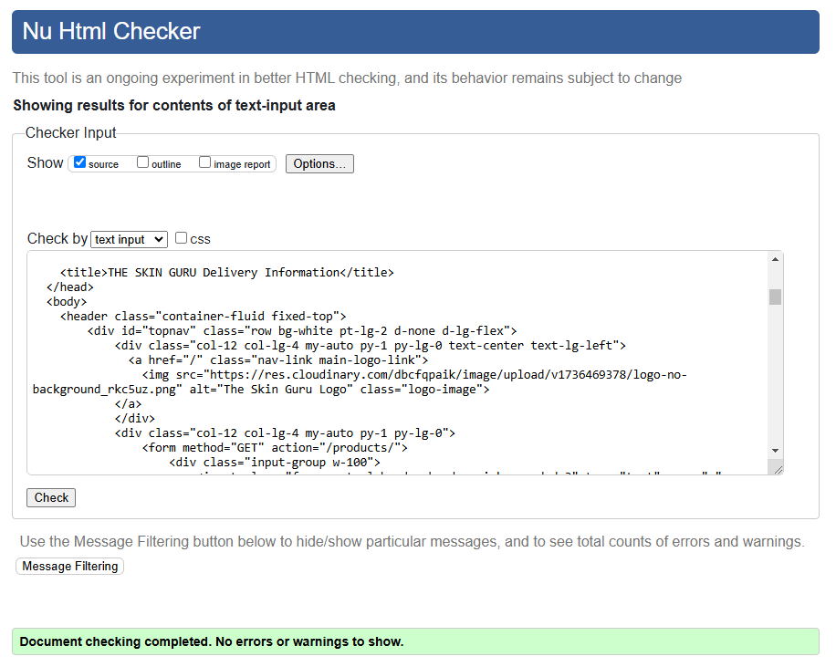
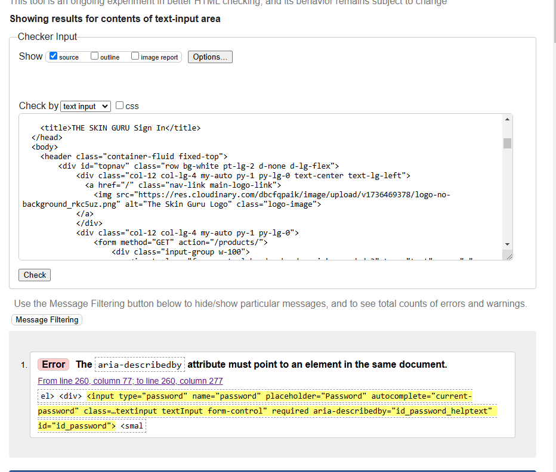
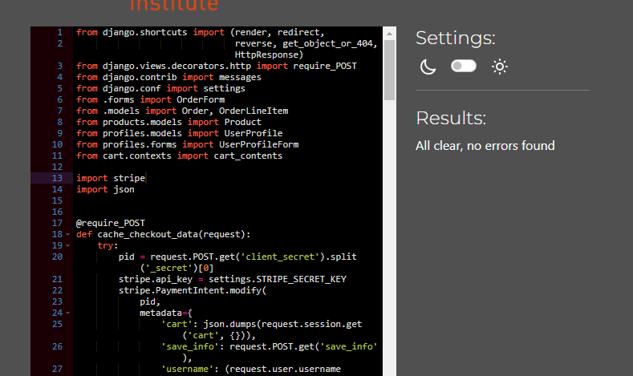
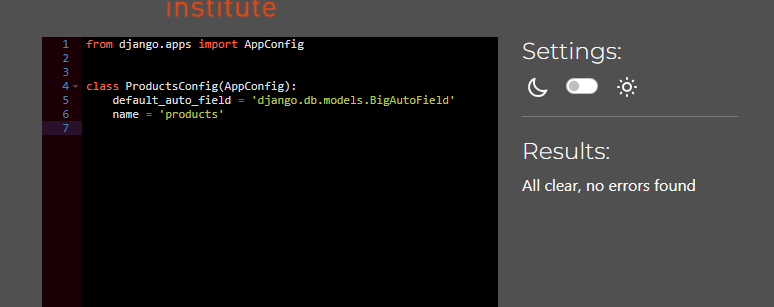
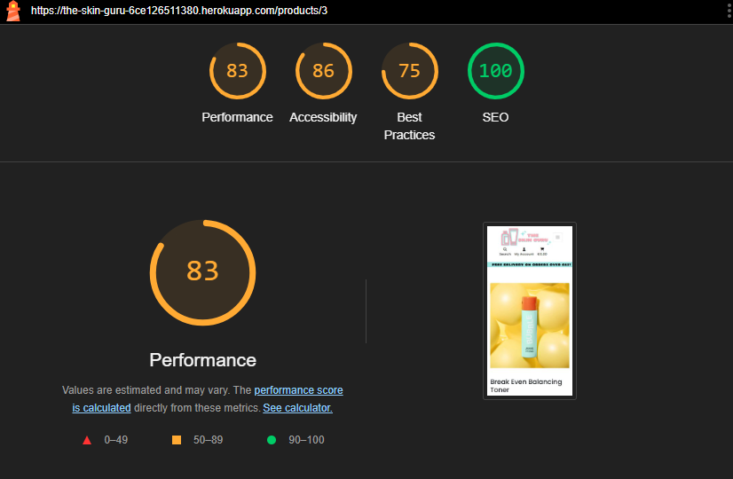

# Testing

This is the TESTING file for [The Skin guru](https://the-skin-guru-6ce126511380.herokuapp.com/)

Return to the [README.md](README.md) file.

## Contents

* [HTML Validation](#html-validation)
* [CSS Validation](#css-validation)
* [JS Validation](#css-validation)
* [Pep8 Validation](#pep8-validation)
* [Lighthouse scores using Chrome Dev Tools](#lighthouse-scores-using-chrome-dev-tools)
* [Device Testing and Browser Compability Testing](#device-testing-and-browser-compatibility-testing)
* [Manual Testing](#manual-testing)
    * [User Stories testing](#user-stories-testing)
    * [User Input testing](#user-input-testing)
* [Security Features](#security-features)
* [Bugs](#bugs)

 

____

#### HTML Validation

For testing my HTML for this project, I used the Validate by Direct Input option on W3C Markup Validation. 

 

I checked all pages of the site in this way and the results are below:

All Pages HTML Validation

 

| HTML Page | Errors | Warnings | Screenshot |
| ---- | ------ | -------- | -------- | 
| Home | None | None | As above |
| All Products | None | None |  |
| Product details | None | None |  |
| All Articles | None | None |  |
| Article Details | None | None |  |
| My Profile | None | None |  |
| My Wishlist | None | None |  |
| Cart | None | None |  |
| Checkout | None | None |  |
| Checkout Success | None | None |  |
| Contact | None | None |  |
| Delivery Info | None | None |  |
| Sign in | 1 | None |  |
| Sign up | 2 | None |  |
| 404 | None | None |  |
| 500 | None | None |  |

The Sign In & Sign Up pages both showed small errors, however as these templates are made up of includes, blocktrans and redirect blocks, I was unable to find there these issues were coming from.

 

____

### CSS Validation

My direct input CSS Validation checks returned no errors. There were warnings present on the deployed url input, however these relate to mailchimp and boostrap and do not have any effect on my code.

 

 

All CSS Validation

 

| CSS Doc | Errors | Warnings | Screenshot |
| ---- | ------ | -------- | -------- | 
| base.css | None | None |  |
| checkout.css | None | None |  |
| posts.css | None | None |  |
| profile.css | None | None |  |

 

____

### JS Validation

I checked my JavaScript code using JSHint, and input a variation of the following lines into the top of the input box to correctly test the code without throwing errors.
/* jshint esversion: 6, jquery: true, browser: true */ /* global Stripe, bootstrap */
 

All CSS Validation

 

| JS File | Errors | Warnings | Screenshot |
| ---- | ------ | -------- | -------- | 
| comments.js | None | None |  |
| countryfield.js | None | None |  |
| reviews.js | None | None |  |
| stripe_elements.js | None | None |  |

 

____

#### Pep8 Validation

CI Python Linter was used to validate the Python files. Some minor line lenght isues, missing lines, and trailing white space errors were raised and fixed in all .py files before final deployment.

 

All Python Validation

 

| Python App | File  | Errors | Screenshot |
| ---- | ------ | -------- | -------- | 
| Articles App | admin.py | None |  |
|  | apps.py | None |  |
|  | forms.py | None |  |
|  | models.py | None |  |
|  | urls.py | None |  |
|  | views.py | None |  |
| ---- | ------ | -------- | -------- | 
| Cart App | apps.py | None |  |
|  | contexts.py | None |  |
|  | urls.py | None |  |
|  | views.py | None |  |
| ---- | ------ | -------- | -------- | 
| Checkout App | admin.py | None |  |
|  | apps.py | None |  |
|  | forms.py | None |  |
|  | models.py | None |  |
|  | signals.py | None |  |
|  | urls.py | None |  |
|  | views.py | None |  |
|  | wehbook_handler.py | None |  |
|  | webhook.py | None |  |
| ---- | ------ | -------- | -------- | 
| Contact App | admin.py | None |  |
|  | apps.py | None |  |
|  | forms.py | None |  |
|  | models.py | None |  |
|  | urls.py | None |  |
|  | views.py | None |  |
| ---- | ------ | -------- | -------- | 
| Home App | apps.py | None |  |
|  | urls.py | None |  |
|  | views.py | None |  |
| ---- | ------ | -------- | -------- | 
| Products App | admin.py | None |  |
|  | apps.py | None |  |
|  | forms.py | None |  |
|  | models.py | None |  |
|  | urls.py | None |  |
|  | views.py | None |  |
| ---- | ------ | -------- | -------- | 
| Profiles App | apps.py | None |  |
|  | forms.py | None |  |
|  | models.py | None |  |
|  | urls.py | None |  |
|  | views.py | None |  |
| ---- | ------ | -------- | -------- | 
| Wishlist | admin.py | None |  |
|  | apps.py | None |  |
|  | contexts.py | None |  |
|  | models.py | None |  |
|  | signals.py | None |  |
|  | urls.py | None |  |
|  | views.py | None |  |
| ---- | ------ | -------- | -------- | 
| The Skin Guru Project | urls.py | None |  |
|  | views.py | None |  |

 

___

### Lighthouse scores using Chrome Dev Tools

DESKTOP

 

| Page | Lighthouse Score |
| ---- | ------ | 
| Home |  |
| All Products |  |
| Individual Product |  |
| All Articles |  |
| Individual Article |  |
| Profile |  |
| Wishlist |  |
| Contact |  |
| Delivery |  |

 

MOBILE

 

| Page | Lighthouse Score |
| ---- | ------ | 
| Home |  | 
|All Products  |  |
| Individual Product |  |
| All Articles |  |
| Individual Article |  |
| Profile |  |
| Wishlist |  |
| Contact |  |
| Delivery |  |

 

Best Practices Issues

 

| Page | Lighthouse Score |
| ---- | ------ | 
| Https Issues  |  | 
| Cookies Issues |  |
|

As shown in the screenshots above, the use of third party cookies is causing my best practices score to be so low. This is across all pages. There is also https issues coming from the Cloudinary hosted images. I will look into how to get around these issues for future development of this project.

 

___

### Device Testing and Browser Compatibility Testing

The Skin Guru was tested on the following:

**Devices**

| Device | Features Tested | Issues |
| ---- | ------ | -------- | 
| Realme 11 Pro+ | All features tested | None |
| Huawei P20 Pro | All features tested | None |
| Acer Laptop | All features tested | None |
| Koorui Desktop | All features tested | None |

**Browsers**
| Browser | Features Tested | Issues |
| ---- | ------ | -------- | 
| Chrome | All features tested | None |
| Opera | All features tested | None |
| Edge | All features tested | None |

 

___

### Manual Testing

#### User Stories Testing

| Epic | User | User Story | Acceptance Criteria Met   | Tested    | PASS/FAIL |
|---------------|---------------|---------------|---------------|------------------|------------------|
| Home Page & Navigation |
| | As a Site User (all users) |
|  |  | I can view the site's home page so that I can understand what the site is for. | Yes | Yes | PASS |
|  |  | I can use the navigation menu so that I can easily make my way around the site | Yes | Yes | PASS |
|  |  | I can use the search bar so that I can search for a specific item. | Yes | Yes | PASS |
|  |  | I can shop products by “Skin Type” or “Product Type” so that I can view all available products in that category. (site inlcudes Shop by Brand) | Yes | Yes | PASS |
|  |  | I can create an account easily from the navbar so that I can log in to the site. | Yes | Yes | PASS |
|  |  |  I can log in to my account easily from the navbar so that I can manage my account. | Yes | Yes | PASS |
|  |  | I can click the Cart button in the navbar so that I can view the products in my cart | Yes | Yes | PASS |
| | As a Registered User |
|  |  | I can access my Wishlist from the navbar so that I can view the products in my wishlist. | Yes | Yes | PASS |
| Regristration |
| | As a Site User (all users) |
|  |  | I can register an account  so that I can manage my order history, add products to my wishlist, save my personal details for faster checkout, leave a review on products I’ve purchased, add comments to blogs | Yes | Yes | PASS |
| | As a Registered User |
|  |  | I can edit my personal details on my account so that I can keep them up to date. | Yes | Yes | PASS |
| Products |
| | As a Site User (all users) |
|  |  | I can sort the products displayed on each product page so that I can filter the products to improve my search criteria | Yes | Yes | PASS |
|  |  |  I can click an individual product so that I can view its details | Yes | Yes | PASS |
|  |  |  I can click a -/+ button on a products details page so that I can manage the quantity of the product I want to add to the cart | Yes | Yes | PASS |
|  |  |  I can click “Add to cart” button on a products details page so that I can add to the product to the cart to purchase | Yes | Yes | PASS |
| | As a Site Admin |
|  |  | I can add a product to my site so that I can increase the range of products available on the site. | Yes | Yes | PASS |
|  |  | I can edit existing products so that I can change the products description, price or image etc. | Yes | Yes | PASS |
|  |  | I can delete a product from my site so that I can remove it from sale. | Yes | Yes | PASS |
| Cart |
| | As a Site User (all users) |
|  |  | I can adjust quantities of products in my cart so that I can change the quantity of the product that I wish to purchase | Yes | Yes | PASS |
|  |  | I can click "remove" on a product in my cart so that I can have the product removed from my cart before checkout. | Yes | Yes | PASS |
| Checkout |
| | As a Site User (all users) |
|  |  | I can go to checkout so that I can complete my purchase | Yes | Yes | PASS |
|  |  | I can view my order before checkout so that I can confirm my items for purchase. | Yes | Yes | PASS |
|  |  | I can enter/update my delivery details so that I can provide the correct delivery and contact information. | Yes | Yes | PASS |
|  |  | I can view my order summary details so that I can review my order after it is placed. | Yes | Yes | PASS |
|  |  | I can receive an email after purchase so that I can have confirmation and record of my purchase | Yes | Yes | PASS |
| | As a Registered User |
|  |  | I can see my previously saved details already populated so that I can complete my purchases faster | Yes | Yes | PASS |
| Blog Articles |
| | As a Site User (all users) |
|  |  | I can read blog articles so that I can stay up to date with the latest skincare information. | Yes | Yes | PASS |
|  |  | I can view comments on articles so that I can see the conversation around the articles subject. | Yes | Yes | PASS |
| | As a Registered User |
|  | I can add comments to articles so that I can join in the conversation. | I can see  | Yes | Yes | PASS |
|  | I can edit/update/delete my comments so that I can manage my comments on blog articles | I can see  | Yes | Yes | PASS |
| | As a Site Admin |
|  |  | I can create, read, update, delete Blog Articles so that I can manage my content | Yes | Yes | PASS |
|  |  | I can approve/decline comments so that I can manage the comments section  | Yes | Yes | PASS |
| Contact Form |
| | As a Site User (all users) |
|  |  | I can fill out a contact form so that I can contact the business with any queries I may have | Yes | Yes | PASS |
| | As a Site Admin |
|  |  | I can store contact form submissions so that I can review them | Yes | Yes | PASS |
|  |  | I can mark contact form submissions as read so that I can see how many I still need to process | Yes | Yes | PASS |
| Product Reviews |
| | As a Site User (all users) |
|  |  | I can view reviews on a product so that I can see other users feedback. | Yes | Yes | PASS |
| | As a Registered User |
|  |  | I can create a review on a product I have purchased so that I can give give feedback to the site owners and other users. | Yes | Yes | PASS |
|  |  | I can edit/update/delete my review so that I can manage my reviews. | Yes | Yes | PASS |
| | As a Site Admin |
|  |  | I can approve/decline reviews so that I can filter out negative reviews. | Yes | Yes | PASS |
| Wishlist |
| | As a Registered User |
|  |  | I can click the 'Add to Wishlist' button so that I can keep a record of my favourite items | Yes | Yes | PASS |
|  |  | I can click the 'Wishlist’ heart icon so that I can see all the products in my Wishlist (changed to a link in the My Account dropdown menu) | Yes | Yes | PASS |
|  |  | I can click the 'Remove' button so that I can remove a product from my Wishlist. | Yes | Yes | PASS |
|  |  |  I can click the 'Add to cart' button so that I can add the product to my cart from in my Wishlist | No | No | Will implement in future versions |
| Newsletter |
| | As a Site User (all users) |
|  |  | I can enter my email into the newsletter form so that I can receive marketing emails about new products, promotions and skincare tips. | Yes | Yes | PASS |
| Emails |
| | As a Registered User |
|  |  | I can receive a confirmation email upon registering an account  so that I can verify my account | Yes | Yes | PASS |

 

____

#### User Input Testing

**Navbar**

| Page/Section | User Action    | Expected Result    | PASS/FAIL |
|---------------|---------------|------------------|------------------|
| Navbar |  |  |  |
|  | Click on Logo | Redirect to Home Page | PASS |
|  | Click on ‘Shop by All products’  | Redirect to all products page | PASS |
| Shop by Skin Type | Click on ‘Shop by Skin Type’ | Dropdown reveals Skin Type menu items  | PASS |
|  | Click on ‘Dry Skin’ | Redirect to products page showing only dry skin products + relevant article | PASS |
|  | Click on ‘Oily Skin’ | Redirect to products page showing only oily skin products + relevant article | PASS |
|  | Click on ‘Combination Skin’ | Redirect to products page showing only combination skin products + relevant article | PASS |
|  | Click on ‘Normal Skin’ | Redirect to products page showing only normal skin products + relevant article | PASS |
|  | Click on ‘Snecitive Skin’ | Redirect to products page showing only sensitive skin products + relevant article | PASS |
|  | Click on ‘All Skin Types’ | Redirect to products page showing only all skin types products + relevant article | PASS |
| Shop by Product Type | Click on ‘Shop by Product Type’ | Dropdown reveals Product Type menu items  | PASS |
|  | Click on ‘Cleanser’ | Redirect to products page showing only cleanser category | PASS |
|  | Click on ‘Toner’ | Redirect to products page showing only toner category | PASS |
|  | Click on ‘Moisturiser’ | Redirect to products page showing only moisturiser category | PASS |
|  | Click on ‘Serums’ | Redirect to products page showing only serums category | PASS |
|  | Click on ‘Masks’ | Redirect to products page showing only masks category | PASS |
|  | Click on ‘Scrubs’ | Redirect to products page showing coming soon page | PASS |
|  | Click on ‘SPF’ | Redirect to products page showing only spf category | PASS |
|  | Click on ‘Accessories’ | Redirect to products page showing only accessories category | PASS |
| Shop by Brand | Click on ‘Shop by Brand’ | Dropdown reveals Brand menu items  | PASS |
|  | Click on ‘Bubble’ | Redirect to products page showing only products from Bubble brand | PASS |
|  | Click on ‘LANEIGE’ | Redirect to products page showing only products from LANEIGE brand | PASS |
|  | Click on ‘CeraVe’ | Redirect to products page showing only products from CeraVe brand | PASS |
|  | Click on ‘Q+A’ | Redirect to products page showing only products from Q+A brand | PASS |
|  | Click on ‘Drunk Elephant’ | Redirect to products page showing only products from Drunk Elephant brand | PASS |
|  | Click on ‘Byoma’ | Redirect to products page showing coming soon page | PASS |
|  | Click on ‘The Skin Guru’ | Redirect to products page showing only products from the Skin Guru brand | PASS |
| Search - Desktop | Click on ‘Search our site’ box | Input box ready for text input | PASS |
|  | Click on ‘Search’ button | Initilises search - products displayed if relevant to search criteria otherwise no products available coming soon page displays | PASS |
| Search - Mobile | Click on ‘Search’ icon | Search box appears | PASS |
| My Account - Logged out | Click on ‘My Account’ icon | Dropdown reveals Register/Sign In options  | PASS |
|  | Click on ‘Register’ | Redirect to register page | PASS |
|  | Click on ‘Sign In’ | Redirect to sign in page | PASS |
| My Account - Logged In | Click on ‘My Account’ icon | Dropdown reveals My Profile, My Wishlist & Logout options  | PASS |
|  | Click on ‘My Profile’ | Redirect to users profile page | PASS |
|  | Click on ‘My Wishlist’ | Redirect to wishlist page | PASS |
|  | Click on ‘Log out’ | Redirect to confirm log out page | PASS |
| Log out Page | Click on ‘Log out’ | Redirect to home page | PASS |
| Cart | Click on ‘Cart’ icon | Redirect to cart page | PASS |

**Home Page**

| Page/Section | User Action    | Expected Result    | PASS/FAIL |
|---------------|---------------|------------------|------------------|
| Home page  |  |  |  |
| Shop by Skin Type Section | Click on ‘Dry’ button | Redirect to products page showing only dry skin products | PASS |
|  | Click on ‘Oily’ button | Redirect to products page showing only oily skin products | PASS |
|  | Click on ‘Combo’ button | Redirect to products page showing only combination skin products | PASS |
|  | Click on ‘Normal’ button | Redirect to products page showing only normal skin products | PASS |
|  | Click on ‘Snecitive’ button | Redirect to products page showing only sensitive skin products | PASS |
|  | Click on ‘All Skin’ button | Redirect to products page showing only all skin types products | PASS |
| Read our latest Articles Section | Click on article image | Redirect to article | PASS |
|  | Click on ‘Read More’ button | Redirect to article | PASS |
| Footer Section | Click on Home link | Redirect to home page | PASS |
|  | Click on Blog Articles link | Redirect to All Articles page | PASS |
|  | Click on Delivery info link | Redirect to Delivery info page | PASS |
|  | Click on Privacy Policy link | Privacy Policy opens in new tab | PASS |
|  | Click on ‘Fill out a contact form’ link | Redirect to Contact page | PASS |
|  | Click on Social Media links | Open new tab with appropriate social media site | PASS |
| Mailchimp | Click on email address box | Input box ready for text input, only accept email formats | PASS |
|  | Click on Subscribe button | Thank You for subscribing message | PASS |

**Account**

| Page/Section | User Action    | Expected Result    | PASS/FAIL |
|---------------|---------------|------------------|------------------|
| Login Page  |  |  |  |
|  | Input valid username/email | Field accepts username or email format | PASS |
|  | Input valid password | Field only accepts password formatt | PASS |
|  |  Click Login button | Logs user in, success message, redirects to home page | PASS |
| Register Page  |  |  |  |
|  | Input valid email address (twice) | Field only accepts email format | PASS |
|  | Input valid password (twice) | Field only accepts password formatt | PASS |
|  |  Click Sign Up button | Redirects user to verify email page, alert message | PASS |
| Verify Email Page  |  |  |  |
|  |  Click Confirm button | Redirects user to sign in page, success message | PASS |
| My Profile Page  |  |  |  |
|  |  Click Update information button | Information saved, success message | PASS |
|  |  Click order History links | Redirect to users past order confirmation, aleert message | PASS |
| My Wishlist Page  |  |  |  |
| (empty wishlist) |  Click View Products button | Redirect to all products page | PASS |
| (with items) |  Click View button | Redirect to specific product details | PASS |
|  |  Click Remove button | Remove product from wishlist, success message | PASS |
| Sign out Page  |  |  |  |
|  |  Click Siign out button | Redirects to home page, success message | PASS |

**Products**

| Page/Section | User Action    | Expected Result    | PASS/FAIL |
|---------------|---------------|------------------|------------------|
| All Products Page  |  |  |  |
|  | Click Sort by dropdown | Shows sorting options for users, sorts products by selected criteria  | PASS |
| related Articles section | Click on Read More button| Redirects to specific article | PASS |
|  | Click product image | Redirect to specific product details | PASS |
| Individual Product Page  |  |  |  |
|  |  Click on Add to wishlist (loggin in users only) | product added to wishlist, success message | PASS |
|  |  Click on +/- Qty buttons | Product increments/decrements appropriately with number display, correct qty amount submits to cart.Decrement button disabled when at 1 | PASS |
|  |  Click on Keep Shopping button | Returns to all products page | PASS |
|  |  Click on Add to Cart button | Product added to cart, succes message, mini cart displayed | PASS |
| Key Ingredients section |  Click on All ingredient dropdown | All ingredient display dropdown | PASS |
| Review section - logged out |  Click on Register/Sign in links | Redirects to register/sign in pages | PASS |
| Review section - logged in & has purchased |  Click on Rating dropdown | 1-5 selections available | PASS |
|  |  Click on Review Comment input box | Input box ready for text input | PASS |
|  |  Click on Submit button | User review submitted, awaiting approval, success message | PASS |
| Editing Reviews |  Click on Edit button | Form populated with users review ready to be edited | PASS |
|  |  Click on Update button | Review submitted for approval, success message | PASS |
| Deleting Reviews |  Click on Delete button | Confirm delete modal pop up requiring delete confirmation | PASS |
|  |  Click on Delete button | Review deleted, page refresh, success message | PASS |

**Articles**

| Page/Section | User Action    | Expected Result    | PASS/FAIL |
|---------------|---------------|------------------|------------------|
| All Articles Page  |  |  |  |
|  | Click Article image | Redirect to specific article  | PASS |
|  | Click Read More button | Redirect to specific article  | PASS |
| Individul Articles | Click on product links in article | Redirects to specific product | PASS |
| Comment section - logged out |  Click on Register/Sign in links | Redirects to register/sign in pages | PASS |
| Comment section - logged in |  Click on Comment Input box | Input box ready for input | PASS |
|  |  Click on Submit button | User comment submitted, awaiting approval, success message | PASS |
| Editing Comments |  Click on Edit button | Form populated with users comment ready to be edited | PASS |
|  |  Click on Update button | Comment submitted for approval, success message | PASS |
| Deleting Comments |  Click on Delete button | Confirm delete modal pop up requiring delete confirmation | PASS |
|  |  Click on Delete button | Comment deleted, page refresh, success message | PASS |

**Contact Page**

| Page/Section | User Action    | Expected Result    | PASS/FAIL |
|---------------|---------------|------------------|------------------|
|  |  |  |  |
|  |  Input Name | Required | PASS |
|  |  Input Email | Required, only accepts email format | PASS |
|  |  Input Message | Required | PASS |
|  |  Click Send Message button | Form submits, success message | PASS |

**Cart & Checkout Pages**

| Page/Section | User Action    | Expected Result    | PASS/FAIL |
|---------------|---------------|------------------|------------------|
| Cart Page  |  |  |  |
|  |  Click on +/- Qty buttons | Product increments/decrements appropriately with number display, Decrement button disabled when at 1. | PASS |
|  |  Click Update button | Correct new qty amount displays in qty box, success message | PASS |
|  |  Click Remove button | Removes product from cart| PASS |
|  |  Click Keep Shopping button | Redirects back to all products page | PASS |
|  |  Click Secure Checkout button | Redirects to checkout page | PASS |
| Checkout Page  |  |  |  |
|  |  Input Full Name | Required | PASS |
|  |  Input Email | Required, only accepts email format, prepopulated if logged in & saved | PASS |
|  |  Input Street Address 1 | Required, prepopulated if logged in & saved | PASS |
|  |  Input Street Address 2 | Required, prepopulated if logged in & saved | PASS |
|  |  Input Town or City | Required, prepopulated if logged in & saved | PASS |
|  |  Input County | Not required, prepopulated if logged in & saved | PASS |
|  |  Input Postal Code| Not required, prepopulated if logged in & saved | PASS |
|  |  Input Coutry | Required, prepopulated if logged in & saved, dropdown selection | PASS |
|  |  Input Phone Number | Required, prepopulated if logged in & saved | PASS |
|  |  Click Register/Sign in to save info links | Redirects to Register or Sign In pages | PASS |
|  |  Check Save info box  | Autoselected when logged in, saves details to users profile | PASS |
|  |  Input Card Details | Required, validates on input | PASS |
|  |  Click Adjust Cart button  | Redirects back to cart page | PASS |
|  |  Click Complete Order button  | Checkout completes, redirects to checkout success page, order summary available, success message | PASS |
| Checkout Success page |  Click Read latest Articles button  | Redrects to all articles page | PASS |

**Admin Functionality**

| Page/Section | Action    | Expected Result    | PASS/FAIL |
|---------------|---------------|------------------|------------------|
| Admin Panel  |  |  |  |
|  | CRUD Functionality |  Admin has full crud functionalit for all feature of the site | PASS |
|  | Comments & Reviews |  Admin can approve or decline reviews and comments | PASS |
|  | Contact Forms |  Admin can mark contact fomrs as read | PASS |

**Defensive Redirects**

| Page/Section | User Action    | Expected Result    | PASS/FAIL |
|---------------|---------------|------------------|------------------|
| URL |  |  |  |
|  | Type in profiles URL when user is not authorised | Redirect to Sign In page | PASS |
|  | Type in wishlist URL when user is not authorised | Redirect to Sign In page | PASS |

**Custome Error Pages**

| Page/Section | User Action    | Expected Result    | PASS/FAIL |
|---------------|---------------|------------------|------------------|
| 404 Error Page  |  |  |  |
|  | Type in URL that does not exist | Custom 404 Error page is displayed  PASS |
|  | Click on 'Home' button | Redirects to Home page | PASS |
| 500 Error Page |  |  |  |
|  | Server error | Custom 500 Error page is displayed | PASS |
|  | Click on 'Home' button | Redirects to Home page | PASS |

 

___

### Security Features

My SECRET_KEY was accidentally hard coded into the the project settings file and committed to GitHub, causing a security vulnerability. I have resolved this by moving my SECRET_KEY into my env.py file and have generated a new key value using [Djecrety](https://djecrety.ir/), a django secret key generator.

 

___

### Bugs

I had been having issues with Stripe Webhooks not working correctly and order confirmation emails not sending to guest checkouts, however it was a simple error in my code. I'm not actually sure where I got the code that was causing the issue to begin with but it was a simple fix as seen here is this [commit message.](https://github.com/abigail-ryan/the-skin-guru/commit/50442ee177a3aa34b4e20a48dd2020ed9fa6cf5b)

All tests have passed and there are currently no known bugs at the time of final deployment. 

___
